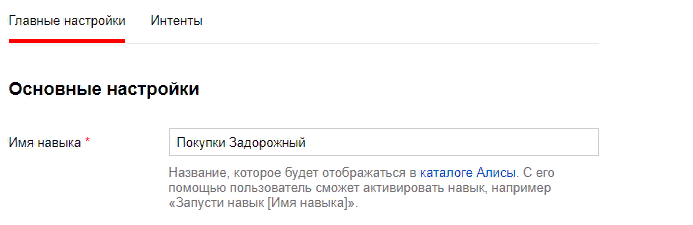
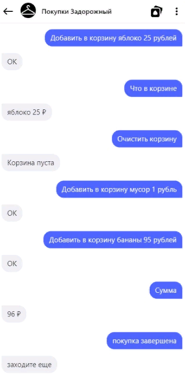
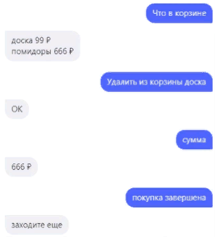
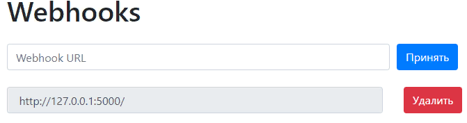

<p align="center">МИНИСТЕРСТВО НАУКИ  И ВЫСШЕГО ОБРАЗОВАНИЯ РОССИЙСКОЙ ФЕДЕРАЦИИ<br>
Федеральное государственное автономное образовательное учреждение высшего образования<br>
"КРЫМСКИЙ ФЕДЕРАЛЬНЫЙ УНИВЕРСИТЕТ им. В. И. ВЕРНАДСКОГО"<br>
ФИЗИКО-ТЕХНИЧЕСКИЙ ИНСТИТУТ<br>
Кафедра компьютерной инженерии и моделирования</p>
<br>
<h3 align="center">Отчёт по лабораторной работе № 2<br> по дисциплине "Программирование"</h3>
<br><br>
<p>студента 1 курса группы ИВТ-б-о-201(1)<br>
Задорожного Глеба Алексеевича<br>
направления подготовки 09.03.01 "Информатика и вычислительная техника"</p>
<br><br>
<table>
<tr><td>Научный руководитель<br> старший преподаватель кафедры<br> компьютерной инженерии и моделирования</td>
<td>(оценка)</td>
<td>Чабанов В.В.</td>
</tr>
</table>
<br><br>
<p align="center">Симферополь, 2020</p>
<hr>

## <p align="center">Лабораторная работа №2 Алиса
## Цель: 
Получить представления о структуре post-запроса;<br>
Изучить webhooks как метод взаимодействия web-приложений;<br>


## Постановка задачи
1. Разработайте и зарегистрируйте навык для Алисы на сервисе Яндекс.Диалоги;
2. В качестве backend-a для навыка реализуйте приложение на языке С++ выполняющее следующие функции:
   1. Составление продуктовой корзины: 
        * Добавление продукта в корзину;<br>
        * Удаление продукта из корзины;<br>
        * Очистка корзины;<br>
        * Вывод списка товаров в корзине;<br>
        * Подсчёт стоимости товаров в корзине.<br>
   2. Вывод справочной информации по навыку;<br>
   3. Регистрацию webhook-ов сторонних сервисов;<br>
   4. Отправку данных на сторонние сервисы. <br>


3. В качестве стороннего сервиса реализуйте приложение на языке Python выполняющее следующие функции:<br>
    1. Ожидание данных о покупке;<br>
    2. Сохранение поступивших данных в excel-документ.
Подробности указаны далее.


## Ход работы
Первым делом я создал на сайте Яндекс.Диалоги свой диалог, назвал его Покупки Задорожный (Рис.1).<br><br>


<div align="center"></div><br>
<p align="center">Рис.1 Раздел "Настройка" Яндекс.Диалоги</p>
<br><br>

Изучил работу вебхуков, а также разобрался со структурой json для работы с яндексом. Для комфортной работы использовал https://jsonviewer.io/tree.
<br>
Написал функционал для работы с корзиной, ниже на рисунке 2 показана работоспособность кода.<br><br>
<p align="center">
<br>
Рис.2 Корзина</p>
<br><br>
Написал функционал для работы в режиме помощь, на рисунке 3 показана работоспособность кода.<br><br>
<p align="center">
<br>
Рис.3 Помощь</p>
<br><br>
Скриншот страницы управления webhook-ами с добавленным webhook-ом клиентского приложения (Рис.4).<br><br>
<p align="center">
<br>
Рис.4 Страница управления вебхуками.</p>
<br><br>
Ссылка на excel-файл заполненный клиентским приложением.
> https://yadi.sk/i/hkj70AB1y4RGbg


<br><br>

Полный исходный код серверного приложения;

```C++

#include <iostream>
#include <string>
#include <cpp_httplib/httplib.h>
#include <vector>
#include <nlohmann/json.hpp>
#include <fstream>
#include <cmath>
#include <iomanip>
using namespace std;
using namespace httplib;
using json = nlohmann::json;
// В этой функции формируем ответ сервера на запрос
void gen_response(const Request& req, Response& res) {
    ifstream lstrc("config.json");// получение данных из конфига в config, для отправки вебхуков во время завершения покупок
    json config;
    lstrc >> config;
    // Выводим на экран тело запроса
    json body = json::parse(req.body.c_str());//получаем от яндекса json
        string str;
        string button = "0";
        int statusbutton = 0;
        if (body["request"]["type"] == "ButtonPressed")
        {
                    button = body["request"]["payload"]["title"];
                    statusbutton = 1;
        }
        if (body["request"]["original_utterance"] == json("ping") && empty(body["request"]["command"]))// Ответ на периодическую проверку яндекса
        { 
            str = u8R"(
                                    {
                                      "response": {
                                        "text": "Навык работает!",
                                        "tts": "Навык работает.",
                                        "buttons": [
                                        ],
                                        "end_session": false
                                      },
                                      "version": "1.0"
                                    })";
        }
        else {// если это касается диалога
            if (body["session"]["new"] == true) // подготовка шаблона разметки для Приветствия
            {//приветствие
                str = u8R"(
                                    {
                                      "response": {
                                        "text": "Здравствуйте! Я помогу вам с покупками.",
                                        "tts": "Здравствуйте! Я помогу вам с покупками.",
                                        "buttons": [
                                                        {
                                                            "title": "Помощь",
                                                            "payload": {"title": "помощь"},
                                                            "hide": true
                                                        },{
                                                            "title": "Молчать",
                                                            "payload": {"title": "молчать"},
                                                            "hide": true
                                                        }
                                        ],
                                        "end_session": false
                                      },
                                        "session_state": {
                                              "basket": [],
                                              "dtbv": true,
                                              "operating_mode": "main"

                                          },
                                      "version": "1.0"
                                    })";
            }
            else {
                //диалог после приветствия
                if (empty(body["state"]["session"]))//  не валидны данные сессии
                { // алерт и завершение
                    str = u8R"(
                                    {
                                      "response": {
                                        "text": "Ошибка! Сессия не валидна.",
                                        "tts": "Ошибка! Сессия не валидна.",
                                        "buttons": [
                                        ],
                                        "end_session": true
                                      },
                                      "version": "1.0"
                                    })";
                }

                else { // успешно
                    string strwait;//шаблон json для работы в не help
                       strwait = u8R"(
                                    {
                                      "response": {
                                        "text": "Навык работает!",
                                        "tts": "sil <[500]>",
                                        "buttons": [
                                                        {
                                                            "title": "Помощь",
                                                            "payload": {"title": "помощь"},
                                                            "hide": true
                                                        },{
                                                            "title": "Молчать",
                                                            "payload": {"title": "молчать"},
                                                            "hide": true
                                                        }
                                        ],
                                        "end_session": false
                                      },
                                        "session_state": {
                                              "basket": [],
                                              "dtbv": true,
                                              "operating_mode": "main"

                                          },
                                      "version": "1.0"
                                    })";
                       string helptokens;
                       if (statusbutton != 1) {
                           for (int i = 0; i < body["request"]["nlu"]["tokens"].size(); i++)// формирование запроса 
                           {
                               if (i == body["request"]["nlu"]["tokens"].size() - 1)
                               {
                                   helptokens += string(body["request"]["nlu"]["tokens"][i]);
                               }
                               else {
                                   helptokens += string(body["request"]["nlu"]["tokens"][i]).append(" ");
                               }
                           }
                       }

                       int go = 0;// 0 если главный режим
                       if (((body["state"]["session"]["operating_mode"] == "help" || body["request"]["nlu"]["tokens"][0] == u8R"(помощь)") && helptokens != u8R"(выход из режима справки)" || button == u8R"(помощь)") && button != u8R"(выход из режима справки)") {
                       //если help мод
                           strwait = u8R"(
                                    {
                                      "response": {
                                        "text": "Навык работает!",
                                        "tts": "sil <[500]>",
                                        "buttons": [
                                                        {
                                                            "title": "Помощь",
                                                            "payload": {"title": "помощь"},
                                                            "hide": true
                                                        },{
                                                            "title": "Молчать",
                                                            "payload": {"title": "молчать"},
                                                            "hide": true
                                                        },{
                                                            "title": "Говорить",
                                                            "payload": {"title": "говорить"},
                                                            "hide": true
                                                        },{
                                                            "title": "Корзина",
                                                            "payload": {"title": "корзина"},
                                                            "hide": true
                                                        },{
                                                            "title": "Что в корзине",
                                                            "payload": {"title": "что в корзине"},
                                                            "hide": true
                                                        },{
                                                            "title": "Добавить в корзину",
                                                            "payload": {"title": "добавить в корзину"},
                                                            "hide": true
                                                        },{
                                                            "title": "Очистить корзину",
                                                            "payload": {"title": "очистить корзину"},
                                                            "hide": true
                                                        },{
                                                            "title": "Удалить из корзины",
                                                            "payload": {"title": "удалить из корзины"},
                                                            "hide": true
                                                        },{
                                                            "title": "Сумма",
                                                            "payload": {"title": "сумма"},
                                                            "hide": true
                                                        },{
                                                            "title": "Покупка завершена",
                                                            "payload": {"title": "покупка завершена"},
                                                            "hide": true
                                                        }
                                        ],
                                        "end_session": false
                                      },
                                        "session_state": {
                                              "basket": [],
                                              "dtbv": true,
                                              "operating_mode": "main"

                                          },
                                      "version": "1.0"
                                    })";
                           go = 1; // 1 если help
                       }
                   // на данном этапе у нас имеется шаблон 
                   json j;
                   j = json::parse(strwait);// преобразование шаблона в json
                   string price;
                   // Обработчик сохраненных данных в сессии
                   j["session_state"]["dtbv"] = body["state"]["session"]["dtbv"];
                   j["session_state"]["basket"] = body["state"]["session"]["basket"];//заполнение шаблона сессионными данными
                   j["session_state"]["operating_mode"] = body["state"]["session"]["operating_mode"];// заполнение режима из сессии
                   //////////////////////////////////////////////// работа с командами
                   if (!j["session_state"]["dtbv"]) // Если False меняем, тк true оставляем как на шаблоне
                   {
                       for (int i = 0; i < j["response"]["buttons"].size(); i++)// Подгрузка голосового помощника
                       {
                           if (j["response"]["buttons"][i]["title"] == u8R"(Молчать)" && go == 0)
                           {
                               j["response"]["buttons"][i]["title"] = u8R"(Говорить)";
                               j["response"]["buttons"][i]["payload"]["title"] = u8R"(говорить)";
                           }
                       }
                   }
                   if (j["session_state"]["operating_mode"] == "help") // Замена кнопки хелп в необх случае
                   {
                       for (int i = 0; i < j["response"]["buttons"].size(); i++)
                       {
                           if (j["response"]["buttons"][i]["title"] == u8R"(Помощь)")
                           {
                               j["response"]["buttons"][i]["title"] = u8R"(Выход из режима справки)";
                               j["response"]["buttons"][i]["payload"]["title"] = u8R"(выход из режима справки)";
                           }
                       }
                   }
                   string exithelp;
                   if (statusbutton != 1) {
                       for (int i = 0; i < body["request"]["nlu"]["tokens"].size(); i++)// формирование запроса
                       {
                           if (i == body["request"]["nlu"]["tokens"].size() - 1)
                           {
                               exithelp += string(body["request"]["nlu"]["tokens"][i]);
                           }
                           else {
                               exithelp += string(body["request"]["nlu"]["tokens"][i]).append(" ");
                           }
                       }
                   }
                   string basketname;
                   string itemname;
                   if (statusbutton != 1) {
                       if (body["request"]["nlu"]["tokens"].size() >= 6 && body["request"]["nlu"]["tokens"][0] == u8R"(добавить)") //формирование команды для добавления
                       {
                           for (int i = 0; i < body["request"]["nlu"]["tokens"].size(); i++)
                           {
                               if (i < 3)
                               {
                                   if (i == 2)
                                   {
                                       basketname += string(body["request"]["nlu"]["tokens"][i]);
                                   }
                                   else {
                                       basketname += string(body["request"]["nlu"]["tokens"][i]).append(" ");
                                   }
                               }
                               else {
                                   if (body["request"]["nlu"]["tokens"][body["request"]["nlu"]["tokens"].size() - 1] == u8R"(р)")
                                   {
                                       price = body["request"]["nlu"]["tokens"][body["request"]["nlu"]["tokens"].size() - 2];
                                   }
                                   if (i < body["request"]["nlu"]["tokens"].size() - 2)
                                   {
                                       if (i == body["request"]["nlu"]["tokens"].size() - 3)
                                       {
                                           itemname += string(body["request"]["nlu"]["tokens"][i]);
                                       }
                                       else {
                                           itemname += string(body["request"]["nlu"]["tokens"][i]).append(" ");
                                       }
                                   }
                               }
                           }
                       }
                   }
                   if (statusbutton != 1) {
                       if (body["request"]["nlu"]["tokens"].size() >= 4 && body["request"]["nlu"]["tokens"][0] == u8R"(удалить)") // формирование команды для удаления
                       {
                           for (int i = 0; i < body["request"]["nlu"]["tokens"].size(); i++)
                           {
                               if (i < 3)
                               {
                                   if (i == 2)
                                   {
                                       basketname += string(body["request"]["nlu"]["tokens"][i]);
                                   }
                                   else {
                                       basketname += string(body["request"]["nlu"]["tokens"][i]).append(" ");
                                   }
                               }
                               else {
                                   if (i < body["request"]["nlu"]["tokens"].size())
                                   {
                                       if (i == body["request"]["nlu"]["tokens"].size() - 1)
                                       {
                                           itemname += string(body["request"]["nlu"]["tokens"][i]);
                                       }
                                       else {
                                           itemname += string(body["request"]["nlu"]["tokens"][i]).append(" ");
                                       }
                                   }
                               }
                           }
                       }
                   }
                   int alt = 0;
                       // Сделать обработчик на поступающие команды
                       if ((body["request"]["nlu"]["tokens"][0] == u8R"(молчать)" && go == 0) || button == u8R"(молчать)" && go == 0)// Молчать main
                       {
                           j["response"]["text"] = u8R"(Молчу, молчу)";
                           for (int i = 0; i < j["response"]["buttons"].size(); i++)
                           {
                               if (j["response"]["buttons"][i]["title"] == u8R"(Молчать)")
                               {
                                   j["response"]["buttons"][i]["title"] = u8R"(Говорить)";
                                   j["response"]["buttons"][i]["payload"]["title"] = u8R"(говорить)";
                                   /*button = u8R"(говорить)";*/
                                   alt = 1;
                               }
                         }
                           j["session_state"]["dtbv"] = false;
                           // Ставлю сопроваждающий текст и меняю кнопку, перебрав все имеющиейся кнопки титл с необходимым заменил
                       }
                       else if ((body["request"]["nlu"]["tokens"][0] == u8R"(говорить)" && go == 0) || (button == u8R"(говорить)" && alt == 0 && go == 0)) {// Говорить main
                           j["response"]["text"] = u8R"(Хорошо)";
                           if (j["session_state"]["dtbv"]) {
                               j["response"]["tts"] = u8R"(Хорошо)";
                           }
                           for (int i = 0; i < j["response"]["buttons"].size(); i++)
                           {
                               if (j["response"]["buttons"][i]["title"] == u8R"(Говорить)")
                               {
                                   j["response"]["buttons"][i]["title"] = u8R"(Молчать)";
                                  j["response"]["buttons"][i]["payload"]["title"] = u8R"(молчать)";
                               }
                           }
                           j["session_state"]["dtbv"] = true;
                       }
                       else if (body["request"]["nlu"]["tokens"][0] == u8R"(корзина)" && go == 1 || button == u8R"(корзина)" && go == 1) {// Корзина help
                           j["response"]["text"] = u8R"(Корзина. Поможет организовать покупки. \n\n О чём рассказать подробнее?)";
                           if (j["session_state"]["dtbv"]) {
                               j["response"]["tts"] = u8R"(Корзина. Поможет организовать покупки.)";
                           }
                       
                       }
                       else if (body["request"]["nlu"]["tokens"][0] == u8R"(говорить)" && go == 1 || button == u8R"(говорить)" && go == 1) {// Говорить help
                           j["response"]["text"] = u8R"(Говорить. Включит голосового помощника. \n\n О чём рассказать подробнее?)";
                           if (j["session_state"]["dtbv"]) {
                               j["response"]["tts"] = u8R"(Говорить. Включит голосового помощника.)";
                           }
                       }
                       else if (body["request"]["nlu"]["tokens"][0] == u8R"(молчать)" && go == 1 || button == u8R"(молчать)" && go == 1) {// Молчать help
                           j["response"]["text"] = u8R"(Молчать. Отключит голосового помощника. \n\n О чём рассказать подробнее?)";
                           if (j["session_state"]["dtbv"]) {
                               j["response"]["tts"] = u8R"(Молчать. Отключит голосового помощника.)";
                           }
                       }
                       else if (exithelp == u8R"(что в корзине)" && go == 1 || button == u8R"(что в корзине)" && go == 1) {// Что в корзине help
                           j["response"]["text"] = u8R"(Что в корзине. Перечислит все товары в твоей корзине. \n\n О чём рассказать подробнее?)";
                           if (j["session_state"]["dtbv"]) {
                               j["response"]["tts"] = u8R"(Что в корзине. Перечислит все товары в твоей корзине.)";
                           }
                       }
                       else if (exithelp == u8R"(добавить в корзину)" && go == 1 || button == u8R"(добавить в корзину)" && go == 1) {// Добавить в корзину help
                           j["response"]["text"] = u8R"(Добавить в корзину. Команда: \n\nДобавить в корзину "Название товара" "Стоимость" рублей \n\n Эта команда добавит в корзину товар. \n\n О чём рассказать подробнее?)";
                           if (j["session_state"]["dtbv"]) {
                               j["response"]["tts"] = u8R"(Добавить в корзину. Эта команда добавит в корзину товар.)";
                           }
                       }
                       else if (exithelp == u8R"(удалить из корзины)" && go == 1 || button == u8R"(удалить из корзины)" && go == 1) {// Удалить из корзины help
                           j["response"]["text"] = u8R"(Удалить из корзины. Команда: \n\nУдалить из корзины "Название товара" \n\n Эта команда удалит товар из корзины. \n\n О чём рассказать подробнее?)";
                           if (j["session_state"]["dtbv"]) {
                               j["response"]["tts"] = u8R"(Удалить из корзины. Эта команда удалит товар из корзины.)";
                           }
                       }
                       else if (exithelp == u8R"(очистить корзину)" && go == 1 || button == u8R"(очистить корзину)" && go == 1) {// Очистить корзину help
                           j["response"]["text"] = u8R"(Очистить корзину. Удалит из корзины все товары. \n\n О чём рассказать подробнее?)";
                           if (j["session_state"]["dtbv"]) {
                               j["response"]["tts"] = u8R"((Очистить корзину. Удалит из корзины все товары.)";
                           }
                       }
                       else if (exithelp == u8R"(сумма)" && go == 1 || button == u8R"(сумма)" && go == 1) {// Сумма help
                           j["response"]["text"] = u8R"(Сумма. Выведет на экран сумму всех товаров в корзине. \n\n О чём рассказать подробнее?)";
                           if (j["session_state"]["dtbv"]) {
                               j["response"]["tts"] = u8R"(Сумма. Выведет на экран сумму всех товаров в корзине.)";
                           }
                       }
                       else if (exithelp == u8R"(покупка завершена)" && go == 1 || button == u8R"(покупка завершена)" && go == 1) {// Покупка завершена help
                           j["response"]["text"] = u8R"(Покупка завершена. Завершит сессию. \n\n О чём рассказать подробнее?)";
                           if (j["session_state"]["dtbv"]) {
                               j["response"]["tts"] = u8R"(Покупка завершена. Завершит сессию.)";
                           }
                       }
                       else if (body["request"]["nlu"]["tokens"][0] == u8R"(помощь)" || button == u8R"(помощь)")// Помощь смена режима
                       {
                           j["response"]["text"] = u8R"(Молчать. Выключит голосовую озвучкую. \n\n Говорить. Включит голосовую озвучку. \n\n Корзина. Поможет организовать покупки. \n\n Помощь. Выведет справку по командам. \n\n Что в корзине. Покажет что в корзине. \n\n Добавить в корзину. Добавит товар в корзину. \n\n Очистить корзину. Очистит корзину. \n\n Удалить из корзины. Удалит товар из корзины. \n\n Сумма. Покажет на какую сумму товары в корзине. \n\n Покупка завершена. Завершит покупку. \n\n О чём рассказать подробнее?")";
                           if (j["session_state"]["dtbv"]) {
                               j["response"]["tts"] = u8R"(О чём рассказать подробнее?)";
                           }
                           for (int i = 0; i < j["response"]["buttons"].size(); i++)
                           {
                               if (j["response"]["buttons"][i]["title"] == u8R"(Помощь)")
                               {
                                   j["response"]["buttons"][i]["title"] = u8R"(Выход из режима справки)";
                                   j["response"]["buttons"][i]["payload"]["title"] = u8R"(выход из режима справки)";
                               }
                           }
                           j["session_state"]["operating_mode"] = "help";
                       }
                       else if (exithelp == u8R"(выход из режима справки)" || button == u8R"(выход из режима справки)") {// Главный режим смена
                           j["response"]["text"] = u8R"(Обращайся ещё)";
                           if (j["session_state"]["dtbv"]) {
                               j["response"]["tts"] = u8R"(Обращайся ещё)";
                           }
                           for (int i = 0; i < j["response"]["buttons"].size(); i++)
                           {
                               if (j["response"]["buttons"][i]["title"] == u8R"(Выход из режима справки)")
                               {
                                   j["response"]["buttons"][i]["title"] = u8R"(Помощь)";
                                   j["response"]["buttons"][i]["payload"]["title"] = u8R"(помощь)";
                               }
                           }
                           j["session_state"]["operating_mode"] = "main";
                       }
                       else if (exithelp == u8R"(очистить корзину)" && go == 0) {//  выполнение команды очистить корзину
                           j["session_state"]["basket"].clear();
                           j["response"]["text"] = u8R"(Корзина пуста)";

                       }                
                       else if (basketname == u8R"(добавить в корзину)" && go == 0) {//  выполнение команды добавить в корзину
                           int szb = j["session_state"]["basket"].size();
                           j["session_state"]["basket"][szb]["price"] = price;
                           j["session_state"]["basket"][szb]["item"] = itemname;
                           j["response"]["text"] = u8R"(ОК)";
                       }                 
                       else if (basketname == u8R"(удалить из корзины)" && go == 0) {// выполнение команды удалить из корзины
                           int szb = j["session_state"]["basket"].size();
                           bool statusdel = false;
                           for (int i = 0; i < szb; i++)
                           {
                               if (j["session_state"]["basket"][i]["item"] == itemname)
                               {
                                   j["session_state"]["basket"].erase(i);
                                   j["response"]["text"] = u8R"(ОК)";
                                   statusdel = true;
                                   break;
                               }
                           }
                           if (!statusdel)
                           {
                               j["response"]["text"] = u8R"(Данного товара нет)";
                           }
                       }                     
                       else if (exithelp == u8R"(что в корзине)" && go == 0) {// выполнение команды что в корзине
                           int szb = j["session_state"]["basket"].size();
                           string inbasket;
                           bool statusvac = true;
                           bool statuswhat = false;
                           for (int i = 0; i < szb; i++)
                           {
                               if (!empty(j["session_state"]["basket"][i]["item"]) && !empty(j["session_state"]["basket"][i]["price"])  ) {
                                   inbasket += string(j["session_state"]["basket"][i]["item"]).append("\t").append(string(j["session_state"]["basket"][i]["price"])).append(u8R"( ₽)").append("\n");
                                   statuswhat = true;
                               }
                               statusvac = false;
                           }
                           if (statuswhat)
                           {
                               j["response"]["text"] = inbasket;
                           }
                           else {

                               j["response"]["text"] = u8R"(Корзина пуста)";
                           }
                       }                                            
                       else if (exithelp == u8R"(сумма)" && go == 0) {// выполнение команды сумма
                       int fullsum = 0;
                       int szb = j["session_state"]["basket"].size();
                       for (int i = 0; i < szb; i++)
                       {
                           if (!empty(j["session_state"]["basket"][i]["item"]) && !empty(j["session_state"]["basket"][i]["price"]))
                           {
                               string temp = j["session_state"]["basket"][i]["price"];
                              fullsum += stoi(temp);
                           }
                       }
                           j["response"]["text"] = to_string(fullsum).append(u8R"( ₽)");
                       }                                           
                       else if (exithelp  == u8R"(покупка завершена)" && go == 0 || button == u8R"(покупка завершена)" && go == 0) {// выполнение команды покупка завершена
                           string url;
                           for (int i = 0; i < config["webhooks"].size(); i++)// отправка вебхуков на подписанный сервисы со страницы /webhooks
                           {
                               //После http:// https:// и до /  heder после [/  footer
                               url = config["webhooks"][i]; // получение ссылок для вебхуков
                               string vihod = u8R"({"user_id": "1","check" : []})"; //наблон выходных данных
                               json temp = json::parse(vihod);
                               if (!empty(body["session"]["user"]["user_id"])) // если авторизован ид
                               {
                                   temp["user_id"] = body["session"]["user"]["user_id"];
                               }
                               else { //если не авторизован anonymous
                                   temp["user_id"] = "anonymous";
                               }
                               int szb = j["session_state"]["basket"].size();
                               bool statuswhat = false;
                               j["response"]["text"] = u8R"(заходите еще)";
                               j["response"]["end_session"] = true;
                               for (int k = 0; k < szb; k++)// добавление в шаблон товаров
                               {

                                   if (!empty(j["session_state"]["basket"][i]["item"]) && !empty(j["session_state"]["basket"][i]["price"])) {

                                       temp["check"].push_back(j["session_state"]["basket"][k]);
                                       statuswhat = true;
                                   }
                               }
                               if (statuswhat)
                               {
                                   if (url.find("ttp"))// примитивная проверка на протокол.. ошибочный ввод
                                   {
                                       string header = url.substr(0, url.find("/", 9));//получение первой части ссылки
                                       string footer = url.substr(url.find("/", 9));// получение второй части ссылки
                                       Client cli(header.c_str());
                                       auto resd = cli.Post(footer.c_str(), temp.dump(), "application/json");

                                       if (resd) { //проверка на то удачно ли прошло
                                           // Проверяем статус ответа, т.к. может быть 404 и другие
                                           if (resd->status == 200) {
                                               // В res->body лежит string с ответом сервера
                                               std::cout << resd->body << std::endl;
                                           }
                                           else {
                                               std::cout << "Status code: " << resd->status << std::endl;
                                           }
                                       }
                                       else {
                                           auto err = resd.error();
                                           std::cout << "Error code: " << err << std::endl;
                                       }
                                   }
                               }
                           }


                       }
                       else {
                           j["response"]["text"] = u8R"(Неизвестная команда)";//некорректный ввод команды
                       }                           
                       str = j.dump();
                }
            }
        }
    // Отправляем ответ яндексу
    res.set_content(str, "text/json; charset=UTF-8");
}


// В этой функции формируем ответ сервера на запрос
// /webhooks Добавление и удаление подписавшихся на вебхук
void gen_responseHook(const Request& req, Response& res) {
    ifstream lsrc("config.json");//Получение json данных о подписавшихся
    json config;
    lsrc >> config;
    if (req.method == "POST") {// выполняется если обращаются с post запросом
        if (req.has_param("del"))//если с параметром del
        {
            auto val_del = req.get_param_value("del");//достаем значение del
            for (int i = 0; i < config["webhooks"].size(); i++) // проходимся по ссылкам куда нужно отправлять данные
            {
                if (config["webhooks"][i] == val_del) // Поиск индекса необходимого значения
                {
                    config["webhooks"].erase(i);// удаляем значение
                    ofstream csrc("config.json");//обновляем кеш
                    csrc << config;
                }
            }
        }   
        if (req.has_param("set"))//если с параметром set
        {
            auto val_set = req.get_param_value("set");//достаем значение set
            config["webhooks"].push_back(val_set);//добавляем новое значение
            ofstream csrc("config.json");// обновляем кеш
            csrc << config;
        }


    }
    ifstream file("Webhooks.html"); // Файловая переменная // достаем разметку страницы для добавления и удаления вебхуков
    string str;                 // Буфер. Тут будет текст файла
    getline(file, str, '\0');// str html страница изменить значения temp*2
    string word1 = "{webhooks_list}";
    int num1 = size(word1);
    string stro;
    for (int i = 0; i < config["webhooks"].size(); i++)// проход по ссылкам для вебхуков .. цель заполнить текущие подписки в разметке
    {// редактирование макета согласно кешу 
        stro.append(u8"<div class=\"form - row align - items - center\"><div class = \"col\" ><input type = \"text\" value = \" ").append(config["webhooks"][i]).append(u8" \" class = \"form-control mb-2\" disabled></div><div class = \"col\"><button type = \"submit\" name = \"del\" value = \"").append(config["webhooks"][i]).append(u8"\" class = \"btn btn-danger mb-2\">Удалить</button></div></div>");
        for (int i = 0; i < stro.length(); i++)
        {
            if (stro[i] == '\\')// убираю экранизацию
            {
                stro.erase(i);
            }
        }
    }
    str.replace(str.find(word1), num1, stro);// замена 
    res.set_content(str, "text/html; charset=UTF-8");// Вывод
}


int main() {
    Server svr;                            // Создаём сервер (пока-что не запущен)
    svr.Post("/", gen_response);           // ждем post на /
    svr.Post("/webhooks", gen_responseHook);           // ожидание post
    svr.Get("/webhooks", gen_responseHook);           // ожидание get
    std::cout << "Start server... OK\n"; // cout использовать нельзя
    ifstream src("config.json");// Во время запуска сервера проверка конфига
    if (!src)// если нет открылся
    {
        string strnewconfig = "{\"webhooks\": []}";//шаблон для загрузки
        json newconfig = json::parse(strnewconfig);// преобразуем строку в json
        ofstream csrc("config.json");//т к конфига нет создаем и заполняем
        csrc << newconfig;

    }
    //ifstream lsrc("config.json");// выше была проверка и подготовка конфига
    //json config;
    //lsrc >> config;// получение данных из конфига
    svr.listen("localhost", 3000);         // Запускаем сервер на localhost и порту 3000
}
```
<br><br>
Полный исходный код клиентского приложения;
```Python

from openpyxl import Workbook
from openpyxl import load_workbook
from flask import Flask, request
import json
import datetime


app = Flask(__name__)
jbuffer = []
@app.route('/', methods=['POST'])
def index():
    rows = request.json
    status = "Ok"
    now = datetime.datetime.now()#текущее время
    for row in rows['check']: # получение новых данных
        dicti = {"user_id":rows['user_id'],"datetime":now.strftime("%d.%m.%Y %H:%M:%S"),"item":row['item'],"price":row['price']}
        jbuffer.append(dicti)
        if len(jbuffer) >= 10:
            try: # проверка на наличие файла
                book = load_workbook("data.xlsx")
            except FileNotFoundError:
                #Если файла нет
                wb = Workbook()
                ws = wb.active
                ws['A1'] = 'N';
                ws['B1'] = 'User ID';
                ws['C1'] = 'Datetime';
                ws['D1'] = 'Item';
                ws['E1'] = 'Prise';
                wb.save("data.xlsx")
            else:
                book.close()
            book = load_workbook("data.xlsx")
            sheet = book.active#достаем данные
            ink = sheet.max_row
            for row in jbuffer:
                sheet[1+ink][0].value = ink;
                sheet[1+ink][1].value = row['user_id'];
                sheet[1+ink][2].value = row['datetime']
                sheet[1+ink][3].value = row['item'];
                sheet[1+ink][4].value = row['price'];
                ink +=1
            try: # проверка на наличие файла
                book.save("data.xlsx")
            except PermissionError:
                status = "permission error"
                break
            else:
                jbuffer.clear()
                status = "added"
    return status

if __name__ == "__main__":
    app.run()
```
<br><br>
## Вывод: 

Получил представление о структуре post-запроса;
Изучил webhooks как метод взаимодействия web-приложений.


