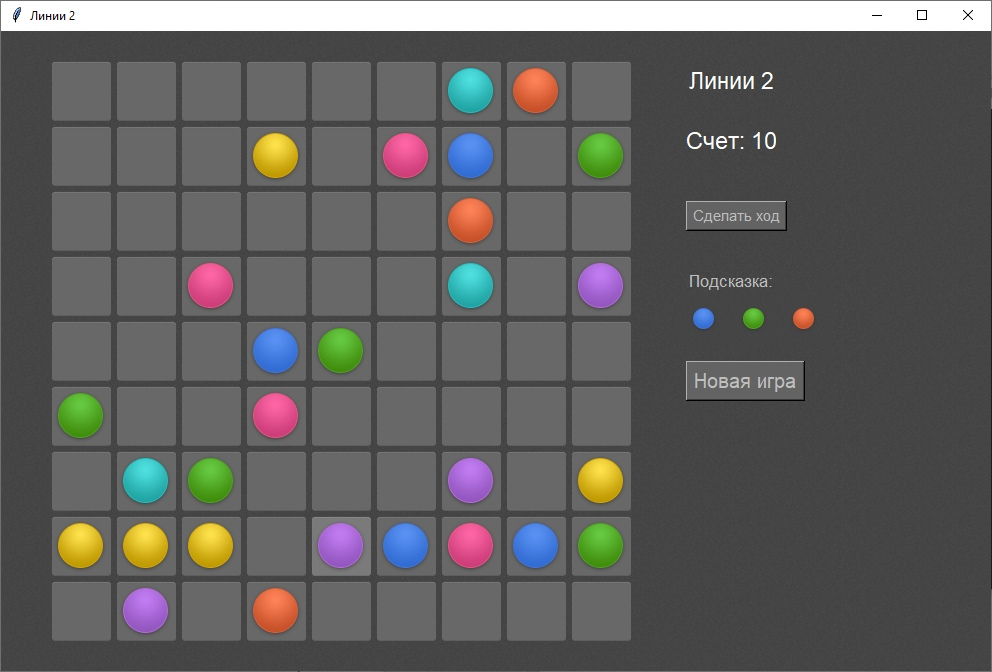

<p align="center">МИНИСТЕРСТВО НАУКИ  И ВЫСШЕГО ОБРАЗОВАНИЯ РОССИЙСКОЙ ФЕДЕРАЦИИ<br>
Федеральное государственное автономное образовательное учреждение высшего образования<br>
"КРЫМСКИЙ ФЕДЕРАЛЬНЫЙ УНИВЕРСИТЕТ им. В. И. ВЕРНАДСКОГО"<br>
ФИЗИКО-ТЕХНИЧЕСКИЙ ИНСТИТУТ<br>
Кафедра компьютерной инженерии и моделирования</p>
<br>
<h3 align="center">Отчёт по лабораторной работе № 3<br> по дисциплине "Программирование"</h3>
<br><br>
<p>студента 1 курса группы ИВТ-б-о-201(1)<br>
Задорожного Глеба Алексеевича<br>
направления подготовки 09.03.01 "Информатика и вычислительная техника"</p>
<br><br>
<table>
<tr><td>Научный руководитель<br> старший преподаватель кафедры<br> компьютерной инженерии и моделирования</td>
<td>(оценка)</td>
<td>Чабанов В.В.</td>
</tr>
</table>
<br><br>
<p align="center">Симферополь, 2020</p>
<hr>

## <p align="center">Лабораторная работа №3 Игра "Lines"
## Цель: 
1. Закрепить навыки разработки программ с простым графическим интерфейсом пользователя на языке Python при помощи библиотеки Tkinter;
2. Получить представление о разработке простых игровых приложений.

## Постановка задачи

1. Используя стандартный модуль для разработки программ с графическим интерфейсом Tkinter реализуйте игру Lines на зыке Python.
2. В качестве образца графического интерфейса используйте [данную игру](http://game-shariki.ru/linii-2).

## Ход работы
В ходе выполнения лабораторной работы использовал образец [этой](http://game-shariki.ru/linii-2) игры.<br>
Для реализации игры изучил необходимые библиотеки: Tkinter для построения интерфейса, Pillow для работы с картинками.<br>
На рисунке 1 представлен скриншот демонстрирующий интерфейс приложения в процессе игры.
<br><br>
<div align="center"></div><br>
<p align="center">Рис.1 Скриншот демонстрирующий интерфейс приложения в процессе игры</p>
<br><br>

<br>
Полный исходный код клиентского приложения;<br>
```


from tkinter import *
from PIL import ImageTk
from PIL import Image
from random import shuffle
from random import randint
import time
import copy
root = Tk()
buffercolors = []# инициализация списков для генерация цветов
buffercolorsex = []
colorpath = ['images/ball-aqua.png','images/ball-blue.png',
            'images/ball-green.png','images/ball-pink.png',
            'images/ball-red.png','images/ball-violet.png','images/ball-yellow.png'] # пути для картинок

rowcol_out = []
status_mode_end = 0#  0 - игра идет, 1 - игра окончена
light_last = [] # список для сохранения последнего подсвеченного шара (координат)
SCORE = 0 # Счет
def initz(event): # Функци Инициализация игры
    global status_mode_end,SCORE
    status_mode_end = 0
    SCORE = 0
    pole.clear()
    for row in range(9):# построения поля из 8, 8 - пустая клетка
        pole.append([])
        for col in range(9):
            pole[row].append(8)
    bg = PhotoImage(file="images/page-bgr.png") # получение картинки фона
    cs = Canvas(width=90, height=30,highlightthickness=0)
    cs.create_image(45, 10, image=bg)
    cs.image = bg#  иначе картинка не будет*
    lab = cs.create_text(45, 10, text="Счет: 0", fill="White",font='MicrosoftSansSerif 17')
    cs.place(x=685,y=100)
    print_pole_back()
    addballs(1)
    cellbgr_image = Image.open("images/page-bgr.png").convert('RGBA')# ячейка
    bg_l = ImageTk.PhotoImage(cellbgr_image.crop((1, 0, 67, 66)).resize((170,40), Image.ANTIALIAS))# вырез темную часть
    clast = Canvas(width=170, height=40,highlightthickness=0)
    clast.create_image(85, 20, image=bg_l)
    lab = clast.create_text(85, 30, text="", fill="#FFFFFF",font='MicrosoftSansSerif 17')
    clast.image = bg_l
    clast.place(x=685,y=400)# размещение по абсолютным координатам 

def dellight(col,row):# функция удаления подсветки фона шара
    if pole[row][col] != 8:
        cellbgr_image = Image.open("images/cell-bgr.png").convert('RGBA')# ячейка
        bgrimgz = cellbgr_image.crop((1, 0, 67, 66)).resize((60, 60), Image.ANTIALIAS)
        pic_size_same_as_bgr1 = Image.new("RGBA", bgrimgz.size)
        pic_size_same_as_bgr1.paste(images_balls[pole[row][col]][6], (3,3))
        ball_over_bgr1 = Image.alpha_composite(bgrimgz, pic_size_same_as_bgr1)
        img_ball_cell1 = ImageTk.PhotoImage(ball_over_bgr1)# получение шара на поле
        lbl_ball_plate1 = Label(root, image=img_ball_cell1,borderwidth=0)
        lbl_ball_plate1.bind("<Button-1>", lambda event: Click(event))
        lbl_ball_plate1.image = img_ball_cell1
        lbl_ball_plate1.pos_r = col
        lbl_ball_plate1.pos_l = row
        lbl_ball_plate1.imgparentball = images_balls[pole[row][col]][6]
        lbl_ball_plate1.place(x=65*col+50,y=65*row+30) 
        rowcol_out[:].clear()


def addballs (event):# функция добавления шаров на поле
    global status_mode_end
    if len(buffercolors) == 0: # проверка на случай инициализации
        buffercolorsex = list(range(0, 7))
        buffercolors[:] =list(range(0, 7))
        buffercolors.extend(buffercolorsex)
        shuffle(buffercolors) # 0 1 2 Это буфер 3 цветов, отобразить
    status_much = 0
    for x in pole:# счетчик свободных ячеек
        for inx in x:
            if inx == 8:
                status_much += 1
    cellbgr_image = Image.open("images/cell-bgr.png").convert('RGBA')# ячейка
    bgrimgz = cellbgr_image.crop((1, 0, 67, 66)).resize((60, 60), Image.ANTIALIAS)
    if status_much == 0:# если конец(нет пустых ячеек) не выполнять код ниже
        return
    if status_much > 0:# если есть место для 1 шара и более
        while True: # получение координат рандомной пустой ячейки (анти-повторение ниже)
            pos1_l = randint(0, 8)
            pos1_r = randint(0, 8)
            if pole[pos1_l][pos1_r] == 8:
                break
        if status_much < 4:# выполняется если это последний ход добавления
            status_mode_end = 1
            cellbgr_image = Image.open("images/page-bgr.png").convert('RGBA')# ячейка
            bg_l = ImageTk.PhotoImage(cellbgr_image.crop((1, 0, 67, 66)).resize((170,40), Image.ANTIALIAS))
            clast = Canvas(width=170, height=40,highlightthickness=0)
            clast.create_image(85, 20, image=bg_l)
            lab = clast.create_text(85, 30, text="Всё, проиграли!", fill="#FFFFFF",font='MicrosoftSansSerif 17')
            SCORE = 0
            clast.image = bg_l
            clast.place(x=685,y=400)
        pole[pos1_l][pos1_r] = buffercolors[0]
        pic_size_same_as_bgr1 = Image.new("RGBA", bgrimgz.size)
        pic_size_same_as_bgr1.paste(images_balls[buffercolors[0]][6], (3,3)) 
        ball_over_bgr1 = Image.alpha_composite(bgrimgz, pic_size_same_as_bgr1)
        img_ball_cell1 = ImageTk.PhotoImage(ball_over_bgr1)
        lbl_ball_plate1 = Label(root, image=img_ball_cell1,borderwidth=0)
        lbl_ball_plate1.bind("<Button-1>", lambda event: Click(event))
        lbl_ball_plate1.image = img_ball_cell1
        lbl_ball_plate1.pos_r = pos1_r
        lbl_ball_plate1.pos_l = pos1_l
        lbl_ball_plate1.cellbgr_image = cellbgr_image
        lbl_ball_plate1.imgparentball = images_balls[buffercolors[0]][6]
        lbl_ball_plate1.place(x=65*pos1_r+50,y=65*pos1_l+30)


    if status_much >1:#  если пустых ячеек более 2-ух
        while True:
            pos2_l = randint(0, 8)
            pos2_r = randint(0, 8)
            if pole[pos2_l][pos2_r] == 8 and (pos1_r != pos2_r or pos1_l != pos2_l):
                break
        pole[pos2_l][pos2_r] = buffercolors[1]
        pic_size_same_as_bgr2 = Image.new("RGBA", bgrimgz.size)
        pic_size_same_as_bgr2.paste(images_balls[buffercolors[1]][6], (3,3))
        ball_over_bgr2 = Image.alpha_composite(bgrimgz, pic_size_same_as_bgr2)
        img_ball_cell2 = ImageTk.PhotoImage(ball_over_bgr2)
        lbl_ball_plate2 = Label(root, image=img_ball_cell2,borderwidth=0)
        lbl_ball_plate2.bind("<Button-1>", lambda event: Click(event))
        lbl_ball_plate2.image = img_ball_cell2
        lbl_ball_plate2.pos_r = pos2_r
        lbl_ball_plate2.pos_l = pos2_l
        lbl_ball_plate2.cellbgr_image = cellbgr_image
        lbl_ball_plate2.imgparentball = images_balls[buffercolors[1]][6]
        lbl_ball_plate2.place(x=65*pos2_r+50,y=65*pos2_l+30) 


    if status_much > 2:# если пустых ячеек более 3-ех
        while True:
            pos3_l = randint(0, 8)
            pos3_r = randint(0, 8)
            if pole[pos3_l][pos3_r] == 8 and ((pos3_r != pos2_r or pos3_l != pos2_l)  and (pos3_r != pos1_r or pos3_l != pos1_l)):
                break
        pole[pos3_l][pos3_r] = buffercolors[2]
        pic_size_same_as_bgr3 = Image.new("RGBA", bgrimgz.size)
        pic_size_same_as_bgr3.paste(images_balls[buffercolors[2]][6], (3,3)) 
        ball_over_bgr3 = Image.alpha_composite(bgrimgz, pic_size_same_as_bgr3)
        img_ball_cell3 = ImageTk.PhotoImage(ball_over_bgr3)
        lbl_ball_plate3 = Label(root, image=img_ball_cell3,borderwidth=0)
        lbl_ball_plate3.bind("<Button-1>", lambda event: Click(event))
        lbl_ball_plate3.image = img_ball_cell3
        lbl_ball_plate3.pos_r = pos3_r
        lbl_ball_plate3.pos_l = pos3_l
        lbl_ball_plate3.cellbgr_image = cellbgr_image
        lbl_ball_plate3.imgparentball = images_balls[buffercolors[2]][6]
        lbl_ball_plate3.place(x=65*pos3_r+50,y=65*pos3_l+30)  #sticky="NSEW",

    if status_mode_end != 1:# если не финал добавления подсказки, иначе ошибка, отсутствие рандомных шаров
        delneedline()# удаление возможных линий
        shuffle(buffercolors)# перемешивания списка уветов в буфере
        pic_size_same_as_bgr1 = Image.new("RGBA", bg_main.size)
        pic_size_same_as_bgr1.paste(images_balls[buffercolors[0]][2], (1,1))
        ball_over_bgr1 = Image.alpha_composite(bg_main, pic_size_same_as_bgr1)
        imgbgFIN1 = ImageTk.PhotoImage(ball_over_bgr1)
        lbl_info1_b = Label(root, image=imgbgFIN1,borderwidth=0)
        lbl_info1_b.image =imgbgFIN1
        lbl_info1_b.place(x=675,y=260)

        pic_size_same_as_bgr2 = Image.new("RGBA", bg_main.size)
        pic_size_same_as_bgr2.paste(images_balls[buffercolors[1]][2], (1,1))
        ball_over_bgr2 = Image.alpha_composite(bg_main, pic_size_same_as_bgr2)
        imgbgFIN2 = ImageTk.PhotoImage(ball_over_bgr2)
        lbl_info2_b = Label(root, image=imgbgFIN2,borderwidth=0)
        lbl_info2_b.image =imgbgFIN2
        lbl_info2_b.place(x=725,y=260)

        pic_size_same_as_bgr3 = Image.new("RGBA", bg_main.size)
        pic_size_same_as_bgr3.paste(images_balls[buffercolors[2]][2], (1,1))
        ball_over_bgr3 = Image.alpha_composite(bg_main, pic_size_same_as_bgr3)
        imgbgFIN3 = ImageTk.PhotoImage(ball_over_bgr3)
        lbl_info3_b = Label(root, image=imgbgFIN3,borderwidth=0)
        lbl_info3_b.image =imgbgFIN3
        lbl_info3_b.place(x=775,y=260)
    # 0 - color: aqua
    # 1 - color: blue
    # 2 - color: green
    # 3 - color: pink
    # 4 - color: red
    # 5 - color: violet
    # 6 - color: yellow

def Click (event):# При нажатии на шар
    global status_mode_end
    if status_mode_end == 1:# если игра окончена не выолняется
        return
    tile = event.widget
    if len(light_last) != 0:
        dellight(light_last[0],light_last[1])
    light_last.clear()
    bgrimgz_l = cellbgr_image.crop((1, 69, 67, 135)).resize((60, 60), Image.ANTIALIAS)
    pic_size_same_as_bgr = Image.new("RGBA", bgrimgz_l.size)
    pic_size_same_as_bgr.paste(tile.imgparentball, (3,3))
    ball_over_bgr = Image.alpha_composite(bgrimgz_l, pic_size_same_as_bgr)
    img_ball_cell = ImageTk.PhotoImage(ball_over_bgr)
    lbl_ball_plate = Label(root, image=img_ball_cell,borderwidth=0)
    lbl_ball_plate.image = img_ball_cell
    lbl_ball_plate.place(x=65*tile.pos_r+50,y=65*tile.pos_l+30)
    local = []
    local.append(int(tile.pos_r))
    local.append(int(tile.pos_l))
    rowcol_out[:] = local
    light_last.append(tile.pos_r)
    light_last.append(tile.pos_l)

def teleport(event):# перемещение шара
    if len(rowcol_out) != 0: # если передана координата откуда, выполняется только если выбран шар до выполнения функции
        tile = event.widget
        pathx = []
        pathy = []
        pathy = []
        dupole = copy.deepcopy(pole)# копия поля
        coordx =[]
        coordx.append(rowcol_out[1])
        coordy =[]
        coordy.append(rowcol_out[0])
        pathx.append([])
        pathy.append([])
        pathx[0].append(coordx[0])
        pathy[0].append(coordy[0])
        def genway (dupole):# получение поля в котором 9 отмечены места куда есть доступ перемещения
            lgth = len(coordx)
            i = 0
            while i < lgth:
                try:
                    if dupole[int(coordx[i])+1][int(coordy[i])] == 8:
                        if coordx[i]+1 < 9:
                            dupole[int(coordx[i])+1][int(coordy[i])] = 9
                            coordx.append(coordx[i] + 1)
                            coordy.append(coordy[i])
                            ind1 = 0
                            for x in pathx:
                                if x[len(x)-1] == coordx[i]:
                                    break
                                ind1+=1
                            pathx.append(copy.deepcopy(pathx[ind1]))
                            pathy.append(copy.deepcopy(pathy[ind1]))
                            pathx[len(pathx)-1].append(coordx[i]+1)
                            pathy[len(pathy)-1].append(coordy[i])

                except IndexError: # На случай выхода за грани поля
                    pass
                try: 
                    if dupole[int(coordx[i])-1][int(coordy[i])] == 8:
                        if coordx[i]-1 > -1:
                            dupole[int(coordx[i])-1][int(coordy[i])] = 9
                            coordx.append(coordx[i] - 1)
                            coordy.append(coordy[i])
                            ind1 = 0
                            for x in pathx:
                                if x[len(x)-1] == coordx[i]:
                                    break
                                ind1+=1
                            pathx.append(copy.deepcopy(pathx[ind1]))
                            pathy.append(copy.deepcopy(pathy[ind1]))
                            pathx[len(pathx)-1].append(coordx[i]-1)
                            pathy[len(pathy)-1].append(coordy[i])
                except IndexError:
                    pass
                try: 
                    if dupole[int(coordx[i])][int(coordy[i])+1] == 8:
                        if coordy[i]+1 < 9 :
                            dupole[int(coordx[i])][int(coordy[i])+1] = 9
                            coordx.append(coordx[i])
                            coordy.append(coordy[i]+1)
                            ind1 = 0
                            for x in pathx:
                                if x[len(x)-1] == coordx[i]:
                                    break
                                ind1+=1
                            pathx.append(copy.deepcopy(pathx[ind1]))
                            pathy.append(copy.deepcopy(pathy[ind1]))
                            pathx[len(pathx)-1].append(coordx[i])
                            pathy[len(pathy)-1].append(coordy[i]+1)
                except IndexError:
                    pass
                try: 
                    if dupole[int(coordx[i])][int(coordy[i])-1] == 8:
                        if coordy[i]-1 > -1:
                            dupole[int(coordx[i])][int(coordy[i])-1] = 9
                            coordx.append(coordx[i])
                            coordy.append(coordy[i]-1)
                            ind1 = 0
                            for x in pathx:
                                if x[len(x)-1] == coordx[i]:
                                    break
                                ind1+=1
                            pathx.append(copy.deepcopy(pathx[ind1]))
                            pathy.append(copy.deepcopy(pathy[ind1]))
                            pathx[len(pathx)-1].append(coordx[i])
                            pathy[len(pathy)-1].append(coordy[i]-1)
                except IndexError:
                    pass

                i+=1
            coordx.reverse()
            k = 0
            while k < lgth:
                coordx.pop()
                k +=1
            coordx.reverse()

            coordy.reverse()
            k = 0
            while k < lgth:
                coordy.pop()
                k += 1
            coordy.reverse()
            if len(coordx) !=0:
                genway (dupole)

        genway(dupole)
        if dupole[tile.row][tile.col] == 9 : # выполняется если переданная координата стоит 9
            lbl_dupleon = Label(root, image=tile.image,borderwidth=0)
            lbl_dupleon.image = tile.image
            lbl_dupleon.row = rowcol_out[1]
            lbl_dupleon.col = rowcol_out[0]
            lbl_dupleon.bind("<Button-1>", lambda event: teleport(event))
            lbl_dupleon.place(x=65*rowcol_out[0]+50,y=65*rowcol_out[1]+30)
            cellbgr_image = Image.open("images/cell-bgr.png").convert('RGBA')
            bgrimgzdu = cellbgr_image.crop((1, 0, 67, 66)).resize((60, 60), Image.ANTIALIAS)
            pic_size_same_as_bgr1du = Image.new("RGBA", bgrimgzdu.size)
            pic_size_same_as_bgr1du.paste(images_balls[pole[rowcol_out[1]][rowcol_out[0]]][6], (1,1))
            ball_over_bgr1du = Image.alpha_composite(bgrimgzdu, pic_size_same_as_bgr1du)
            imgbgFIN1du = ImageTk.PhotoImage(ball_over_bgr1du)
            lbl_dupleonnew = Label(root, image=imgbgFIN1du,borderwidth=0)
            lbl_dupleonnew.imgparentball = images_balls[pole[rowcol_out[1]][rowcol_out[0]]][6]
            lbl_dupleonnew.pos_r = tile.col
            lbl_dupleonnew.pos_l = tile.row
            lbl_dupleonnew.image = imgbgFIN1du
            lbl_dupleonnew.bind("<Button-1>", lambda event: Click(event))
            lbl_dupleonnew.place(x=65*tile.col+50,y=65*tile.row+30)
            temp = pole[rowcol_out[1]][rowcol_out[0]]
            pole[rowcol_out[1]][rowcol_out[0]] = 8
            pole[tile.row][tile.col] = temp
            rowcol_out.clear()
            addballs (1)
images_balls = []
for i in range(0,7):# формирование списка из списков, хранение шаров разных размеров
    images_balls.append([])
    ball_raw_img = Image.open(colorpath[i]).convert('RGBA')# ячейка
    img_ball_st6 = ball_raw_img.crop((1, 1, 55, 56))
    img_ball_st5 = ball_raw_img.crop((1, 61, 55, 115))
    img_ball_st4 = ball_raw_img.crop((1, 121, 55, 175))
    img_ball_st3 = ball_raw_img.crop((1, 181, 55, 235))
    img_ball_st2 = ball_raw_img.crop((1, 241, 55, 295))
    img_ball_st1 = ball_raw_img.crop((1, 301, 55, 355))
    img_ball_st0 = ball_raw_img.crop((1, 361, 55, 415))
    images_balls[i].append(img_ball_st0)
    images_balls[i].append(img_ball_st1)
    images_balls[i].append(img_ball_st2)
    images_balls[i].append(img_ball_st3)
    images_balls[i].append(img_ball_st4)
    images_balls[i].append(img_ball_st5)
    images_balls[i].append(img_ball_st6)
def del_oncoords(coords):# удаление координат, используется при удалении шаров в линии
    i = 0
    cellbgr_image = Image.open("images/cell-bgr.png").convert('RGBA')
    bgrimgzdu = cellbgr_image.crop((1, 0, 67, 66)).resize((60, 60), Image.ANTIALIAS)
    imgbgFIN1du = ImageTk.PhotoImage(bgrimgzdu)
    while i < len(coords):# проход по переданным координатам
        x = coords[i]
        y = coords[i+1]
        lbl_dupleon = Label(root, image=imgbgFIN1du,borderwidth=0)
        lbl_dupleon.image = imgbgFIN1du
        lbl_dupleon.row = x
        lbl_dupleon.col = y
        lbl_dupleon.bind("<Button-1>", lambda event: teleport(event))
        lbl_dupleon.place(x=65*y+50,y=65*x+30)
        pole[x][y] = 8
        global SCORE
        SCORE +=2
        score_temp = SCORE
        cs = Canvas(width=90, height=30,highlightthickness=0)
        cs.create_image(45, 10, image=bg)
        lab = cs.create_text(45, 10, text=['Счет:',str(SCORE)], fill="White",font='MicrosoftSansSerif 17')
        cs.place(x=685,y=100)
        i+=2


def delneedline():# функция удаления линий

    # Ниже представлен поиск линий на поле, а также для диагоналей получение диагоналей вертикально* горизонтально* для упрощения алгоритма
    y = 0
    iupole1 = []
    iupole2 = []
    iupole3 = []
    iupole4 = []
    Xiu1 = []
    Yiu1 = []
    Xiu2 = []
    Yiu2 = []
    while y < len(pole):
        x = 0
        iupole1.append([])
        Xiu1.append([])
        Yiu1.append([])
        while x <= y:
            iupole1[y].append(copy.deepcopy(pole[y][y-x]))
            Xiu1[y].append(y)
            Yiu1[y].append(y-x)
            x += 1

        y +=1
    j = 0
    while j < len(iupole1):
        h = 0
        while h< len(iupole1) - len(iupole1[j]):
            iupole1[j].append(8)
            h +=1
        j+=1
    y = 0
    while y < len(pole):
        x = 0

        iupole2.append([])
        Xiu2.append([])
        Yiu2.append([])
        while x <= y:
            iupole2[y].append(copy.deepcopy(pole[y-x][y]))
            Xiu2[y].append(y-x)
            Yiu2[y].append(y)
            x += 1

        y +=1
    j = 0
    while j < len(iupole2):
        h = 0
        while h< len(iupole2) - len(iupole2[j]):
            iupole2[j].append(8)
            h +=1
        j+=1
    p = 0
    while p<len(iupole1[0]):
        f = 0
        coordsXY = []
        line = []
        hello = []# убрать
        if iupole1[0][p] != 8:
            line.append(copy.deepcopy(iupole1[0][p]))
            coordsXY.append(Xiu1[0][p])
            coordsXY.append(Yiu1[0][p])
        while f< len(iupole1)-1:
            if iupole1[f+1][p] == 8:
                if len(line)> 4:
                    hello = copy.deepcopy(line)
                    del_oncoords(coordsXY)
                coordsXY.clear()
                line.clear()
                f+=1
                continue
            if iupole1[f][p] == iupole1[f+1][p] and f == len(iupole1)-2:
                line.append(copy.deepcopy(iupole1[f+1][p]))
                coordsXY.append(Xiu1[f+1][p])
                coordsXY.append(Yiu1[f+1][p])
                if len(line)> 4:
                    hello = copy.deepcopy(line)
                    del_oncoords(coordsXY)
                coordsXY.clear()
                line.clear()
                f+=1
                continue
            if iupole1[f][p] != iupole1[f+1][p]:
                if len(line)> 4:
                    hello = copy.deepcopy(line)
                    del_oncoords(coordsXY)
                line.clear()
                coordsXY.clear()
            line.append(copy.deepcopy(iupole1[f+1][p]))
            coordsXY.append(Xiu1[f+1][p])
            coordsXY.append(Yiu1[f+1][p])
            f+=1
        line.clear()
        coordsXY.clear()
        p+=1
    coordsXY.clear()
    line.clear()
    p = 0
    while p<len(iupole2[0]):
        f = 0
        coordsXY = []
        line = []
        hello = []
        if iupole2[0][p] != 8:
            line.append(copy.deepcopy(iupole2[0][p]))
            coordsXY.append(Xiu2[0][p])
            coordsXY.append(Yiu2[0][p])
        while f< len(iupole2)-1:
            if iupole2[f+1][p] == 8:
                if len(line)> 4:
                    hello = copy.deepcopy(line)
                    del_oncoords(coordsXY)
                coordsXY.clear()
                line.clear()
                f+=1
                continue
            if iupole2[f][p] == iupole2[f+1][p] and f == len(iupole2)-2:
                line.append(copy.deepcopy(iupole2[f+1][p]))
                coordsXY.append(Xiu2[f+1][p])
                coordsXY.append(Yiu2[f+1][p])
                if len(line)> 4:
                    hello = copy.deepcopy(line)
                    del_oncoords(coordsXY)
                coordsXY.clear()
                line.clear()
                f+=1
                continue
            if iupole2[f][p] != iupole2[f+1][p]:
                if len(line)> 4:
                    hello = copy.deepcopy(line)
                    del_oncoords(coordsXY)
                coordsXY.clear()
                line.clear()
            line.append(copy.deepcopy(iupole2[f+1][p]))
            coordsXY.append(Xiu2[f+1][p])
            coordsXY.append(Yiu2[f+1][p])
            f+=1
        line.clear()
        coordsXY.clear()
        p+=1
    line.clear()
    coordsXY.clear()
    def vertically_getcoords(iupole3):# поиск вертикальных линий
        p = 0
        while p<len(pole[0]):
            f = 0
            coordsXY = []
            line = []
            hello = []
            if iupole3[0][p] != 8:
                line.append(copy.deepcopy(iupole3[0][p]))
                coordsXY.append(0)
                coordsXY.append(p)
            while f< len(iupole3)-1:
                if iupole3[f+1][p] == 8:
                    if len(line)> 4:
                        hello = copy.deepcopy(line)
                        del_oncoords(coordsXY)
                    line.clear()
                    coordsXY.clear()
                    f+=1
                    continue
                if iupole3[f][p] == iupole3[f+1][p] and f == len(iupole3)-2:
                    line.append(copy.deepcopy(iupole3[f+1][p]))
                    coordsXY.append(f+1)
                    coordsXY.append(p)
                    if len(line)> 4:
                        hello = copy.deepcopy(line)
                        del_oncoords(coordsXY)
                    line.clear()
                    coordsXY.clear()
                    f+=1
                    continue
                if iupole3[f][p] != iupole3[f+1][p]:
                    if len(line)> 4:
                        hello = copy.deepcopy(line)
                        del_oncoords(coordsXY)
                    line.clear()
                    coordsXY.clear()
                line.append(copy.deepcopy(iupole3[f+1][p]))
                coordsXY.append(f+1)
                coordsXY.append(p)
                f+=1
            line.clear()
            coordsXY.clear()
            p+=1
        line.clear()
        coordsXY.clear()
    y = 1 
    Xiu3 = []
    Yiu3 = []
    while y < len(pole):
        x = len(pole)
        iupole3.append([])
        Xiu3.append([])
        Yiu3.append([])
        while x >y:
            iupole3[y-1].append(copy.deepcopy(pole[len(pole)-x+y][x-1]))
            Xiu3[y-1].append(len(pole)-x+y)
            Yiu3[y-1].append(x-1)
            x -= 1
        y +=1
    y = 0 
    Xiu4 = []
    Yiu4 = []
    while y < len(pole):
        x = len(pole)
        iupole4.append([])
        Xiu4.append([])
        Yiu4.append([])
        while x >y:
            iupole4[y].append(copy.deepcopy(pole[x-1-y][len(pole)-x]))
            Xiu4[y].append(x-1-y)
            Yiu4[y].append(len(pole)-x)
            x -= 1
        y +=1
    def gorizontally_getcoords(iupole4): # поиск горизонтальных линий
        p = 0
        while p<len(iupole4):
            f = 0
            coordsXY = []
            line = []
            hello = []
            if iupole4[p][0] != 8:
                line.append(copy.deepcopy(iupole4[p][0]))
                coordsXY.append(p)
                coordsXY.append(0)
            while f< len(iupole4[p])-1:
                if iupole4[p][f+1] == 8:
                    if len(line)> 4:
                        hello = copy.deepcopy(line)
                        del_oncoords(coordsXY)
                    line.clear()
                    coordsXY.clear()
                    f+=1
                    continue
                if iupole4[p][f] == iupole4[p][f+1] and f == len(iupole4[p])-2:
                    line.append(copy.deepcopy(iupole4[p][f+1]))
                    coordsXY.append(p)
                    coordsXY.append(f+1)
                    if len(line)> 4:
                        hello = copy.deepcopy(line)
                        del_oncoords(coordsXY)
                    line.clear()
                    coordsXY.clear()
                    f+=1
                    continue
                if iupole4[p][f] != iupole4[p][f+1]:
                    if len(line)> 4:
                        hello = copy.deepcopy(line)
                        del_oncoords(coordsXY)
                    line.clear()
                    coordsXY.clear()
                line.append(copy.deepcopy(iupole4[p][f+1]))
                coordsXY.append(p)
                coordsXY.append(f+1)
                f+=1
            line.clear()
            coordsXY.clear()
            p+=1
        line.clear()
        coordsXY.clear()
    p = 0
    while p<len(iupole4):
        f = 0
        coordsXY = []
        line = []
        hello = []
        if iupole4[p][0] != 8:
            line.append(copy.deepcopy(iupole4[p][0]))
            coordsXY.append(Xiu4[p][0])
            coordsXY.append(Yiu4[p][0])
        while f< len(iupole4[p])-1:
            if iupole4[p][f+1] == 8:
                if len(line)> 4:
                    hello = copy.deepcopy(line)
                    del_oncoords(coordsXY)
                line.clear()
                coordsXY.clear()
                f+=1
                continue
            if iupole4[p][f] == iupole4[p][f+1] and f == len(iupole4[p])-2:
                line.append(copy.deepcopy(iupole4[p][f+1]))
                coordsXY.append(Xiu4[p][f+1])
                coordsXY.append(Yiu4[p][f+1])
                if len(line)> 4:
                    hello = copy.deepcopy(line)
                    del_oncoords(coordsXY)
                line.clear()
                coordsXY.clear()
                f+=1
                continue
            if iupole4[p][f] != iupole4[p][f+1]:
                if len(line)> 4:
                    hello = copy.deepcopy(line)
                    del_oncoords(coordsXY)
                line.clear()
                coordsXY.clear()
            line.append(copy.deepcopy(iupole4[p][f+1]))
            coordsXY.append(Xiu4[p][f+1])
            coordsXY.append(Yiu4[p][f+1])
            f+=1
        line.clear()
        coordsXY.clear()
        p+=1
    line.clear()
    coordsXY.clear()
    p = 0
    while p<len(iupole3):
        f = 0
        coordsXY = []
        line = []
        hello = []
        if iupole3[p][0] != 8:
            line.append(copy.deepcopy(iupole3[p][0]))
            coordsXY.append(Xiu3[p][0])
            coordsXY.append(Yiu3[p][0])
        while f< len(iupole3[p])-1:
            if iupole3[p][f+1] == 8:
                if len(line)> 4:
                    hello = copy.deepcopy(line)
                    del_oncoords(coordsXY)
                line.clear()
                coordsXY.clear()
                f+=1
                continue
            if iupole3[p][f] == iupole3[p][f+1] and f == len(iupole3[p])-2:
                line.append(copy.deepcopy(iupole3[p][f+1]))
                coordsXY.append(Xiu3[p][f+1])
                coordsXY.append(Yiu3[p][f+1])
                if len(line)> 4:
                    hello = copy.deepcopy(line)
                    del_oncoords(coordsXY)
                line.clear()
                coordsXY.clear()
                f+=1
                continue
            if iupole3[p][f] != iupole3[p][f+1]:
                if len(line)> 4:
                    hello = copy.deepcopy(line)
                    del_oncoords(coordsXY)
                line.clear()
                coordsXY.clear()
            line.append(copy.deepcopy(iupole3[p][f+1]))
            coordsXY.append(Xiu3[p][f+1])
            coordsXY.append(Yiu3[p][f+1])
            f+=1
        line.clear()
        coordsXY.clear()
        p+=1
    line.clear()
    coordsXY.clear()
    gorizontally_getcoords(pole)
    vertically_getcoords(pole)
# Построение поля массив[] в первый раз
pole = []
for row in range(9):
    pole.append([])
    for col in range(9):
        pole[row].append(8)

root.title("Линии 2") #Имя окна
tileset = Image.open("images/page-bgr.png").convert('RGBA')# получение фона
tileset1 = tileset.resize((110, 80), Image.ANTIALIAS) # подгон размера
bg_main = tileset.resize((55, 55), Image.ANTIALIAS)
imgbg = ImageTk.PhotoImage(tileset1)# получение тк фото
bgimg = Label(root, image=imgbg, borderwidth=0)
cellbgr_image = Image.open("images/cell-bgr.png").convert('RGBA')# ячейка
bgrimgz = cellbgr_image.crop((1, 0, 67, 66)).resize((55, 55), Image.ANTIALIAS) 
bgrimgz_l = cellbgr_image.crop((1, 69, 67, 135)).resize((55, 55), Image.ANTIALIAS) 
img_cellbgr = ImageTk.PhotoImage(cellbgr_image.crop((1, 0, 67, 66)).resize((60, 60), Image.ANTIALIAS))# вырез темную часть
img_cellbgru = ImageTk.PhotoImage(cellbgr_image.crop((1, 69, 67, 135)).resize((60, 60), Image.ANTIALIAS)) # вырез светл часть
for row in range(8):# фон
    for col in range(9):
        bgimg = Label(root, image=imgbg, borderwidth=0)
        bgimg.grid(row=row,column=col)


def print_pole_back():  #Построение поля (пустого)
    for row in range(9):
        for col in range(9):
            lbl_ball_X = Label(root, image=img_cellbgr,borderwidth=0)
            lbl_ball_X.image = img_cellbgr
            lbl_ball_X.bind("<Button-1>", lambda event: teleport(event))
            lbl_ball_X.row = row
            lbl_ball_X.col = col
            lbl_ball_X.place(x=65*col+50,y=65*row+30)
print_pole_back()# Для первой инициализации
c = Canvas(width=90, height=30,highlightthickness=0) # обход прозрачного фона лейбл
bg = PhotoImage(file="images/page-bgr.png")
c.create_image(45, 10, image=bg)
lab = c.create_text(45, 10, text="Линии 2", fill="White",font='MicrosoftSansSerif 17')
cs = Canvas(width=90, height=30,highlightthickness=0)
cs.create_image(45, 10, image=bg)
lab = cs.create_text(45, 10, text="Счет: 0", fill="White",font='MicrosoftSansSerif 17')
ci = Canvas(width=90, height=30,highlightthickness=0)
ci.create_image(45, 10, image=bg)
lab = ci.create_text(45, 10, text="Подсказка:", fill="#BFBFBF",font='MicrosoftSansSerif 13')
btn_step = Button(root, text="Сделать ход",height="1",fg="#BFBFBF",font='MicrosoftSansSerif 11',bg="#636363")
btn_step.bind("<Button-1>", lambda event: addballs(event))
btn_new = Button(root, text="Новая игра",height="1",fg="#BFBFBF",font='MicrosoftSansSerif 15',bg="#636363")
btn_new.bind("<Button-1>", lambda event: initz(event))
addballs (1) # Добавляем три шара
c.place(x=685,y=40)# Позиции
cs.place(x=685,y=100)
btn_step.place(x=685,y=170)
ci.place(x=685,y=240)
btn_new.place(x=685,y=330)
root.mainloop()
```
<br><br>


## Вывод: 

Закрепил навыки разработки программ с простым графическим интерфейсом пользователя на языке Python при помощи библиотеки Tkinter; Получил представление о разработке простых игровых приложений.


