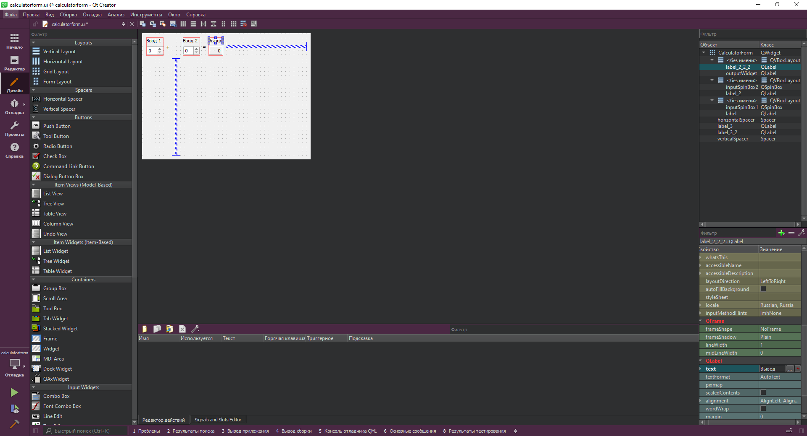
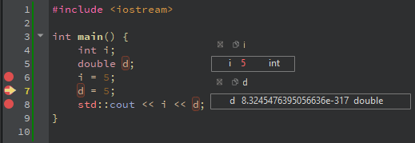

МИНИСТЕРСТВО НАУКИ  И ВЫСШЕГО ОБРАЗОВАНИЯ РОССИЙСКОЙ ФЕДЕРАЦИИ 
Федеральное государственное автономное образовательное учреждение высшего образования 
"КРЫМСКИЙ ФЕДЕРАЛЬНЫЙ УНИВЕРСИТЕТ им. В. И. ВЕРНАДСКОГО" 
ФИЗИКО-ТЕХНИЧЕСКИЙ ИНСТИТУТ 
Кафедра компьютерной инженерии и моделирования

 
<h3 align="center">Отчёт по лабораторной работе № 4  по дисциплине "Программирование"</h3>
  

студента 1 курса группы ИВТ-б-о-201(1) 
Задорожного Глеба Алексеевича 
направления подготовки 09.03.01 "Информатика и вычислительная техника"

  
<table>
<tr><td>Научный руководитель  старший преподаватель кафедры  компьютерной инженерии и моделирования</td>
<td>(оценка)</td>
<td>Чабанов В.В.</td>
</tr>
</table>
  

Симферополь, 2021

## 
Лабораторная работа №4 Знакомство с фреймворком Qt
## Цель: 
1. Установить фреймворк Qt;
2. Изучить основные возможности создания и отладки программ в IDE Qt Creator.

## Постановка задачи

Настроить рабочее окружение, для разработки программного обеспечения при помощи Qt и IDE Qt Creator, а также изучить базовые возможности данного фреймворка.

## Ход работы
#### Задание 1. Установка Qt и работа с примером.  

Скачал с официального сайта Qt, выбрал компоненты необходимые для сборки при помощи MinGW. Открыл пример проекта **Calculator For Example**, в режиме редактирования в категории проект выбрал проект **calculatorform**, перешел в Формы и открыл файл **calculatorform.ui**, после чего нажимая поочередно на каждую надпись *Input* изменил ее на *Ввод*, а надпись *Output* на *Вывод*, для редактирования использовал text в Фильтрах, смотреть рисунок 1.
  

Рисунок 1. Файл calculatorform.ui.

 

#### Задание 2. Ответы на вопросы.  

| Вопрос  | Ответ |
| ------------- | ------------- |
| 1. Как изменить цветовую схему (оформление) среды?  | Для смены цветовой схемы среды необходимо нажать Инструменты, далее Параметры, во вкладке Среда выбрать Интерфейс, в нем настроить цвет и тему. Для смены цветовой схемы текстового редактора необходимо нажать Инструменты, далее Параметры, во вкладке Текстовый редактор выбрать Шрифт и цвета, внизу в выпадающем списке выбрать нужную цветовую схему. |
| 2. Как закомментировать/раскомментировать блок кода средствами Qt Creator?  | Выделить текст и нажать Ctrl + / или выделить текст и нажать ПКМ, в контекстном меню выбрать Закомментировать/раскомментировать. Также можно выделить текст, нажать Правка, Дополнительно, Закомментировать/раскомментировать |
| 3. Как открыть в проводнике Windows папку с проектом средствами Qt Creator?  | На боковой панеле в разделе Редактор, в катеогрии проекты, нажать ПКМ по любому файлу из проекта и в выпадающем контекстном меню выбрать Показать в проводнике. |
| 4. Какое расширение файла-проекта используется Qt Creator?  | .pro  |
| 5. Как запустить код без отладки?  | Ctrl + R или зеленый треугольник на боковой панели  |
| 6. Как запустить код в режиме отладки?  | F5  |
| 7. Как установить/убрать точку останова (breakpoint)?  | Перед нумерациией строк, нажимая на пустое пространство слева ставится (красная) точка останова, чтобы убрать нажать потворно. Нажимая F9 ставится точка останова. |

Таблица 1. Ответы на вопросы.

 

#### Задание 3. Работа в режиме отладчика. 

| Вопрос  | Ответ |
| ------------- | ------------- |
| Чему равны переменные `i` и `d` в 6 строке | `i = 0` `d = 8.324547639505663бе-317(мусор)` (Смотреть рис. 2) 

Рисунок 2.  Переменные i и d в 6 строке.
 |
| Чему равны переменные `i` и `d` в 7 строке | `i = 5` `d = 8.324547639505663бе-317(мусор)` (Смотреть рис. 3) 

Рисунок 3. Переменные i и d в 7 строке.
|
| Чему равны переменные `i` и `d` в 8 строке | `i = 5` `d = 5` (Смотреть рис. 4) 

Рисунок 4. Переменные i и d в 8 строке.
|

Таблица 2. Работа в режиме отладчика.

 

#### Задание 4. Настройка .gitignore под Qt. 
Файл **.gitignore** дополнен и находится в репозитории *Programming*.  Смотреть - [тут][1].

[1]: /.gitignore

## Вывод: 

Установил фреймворк Qt; Изучил основные возможности создания и отладки программ в IDE Qt Creator.

