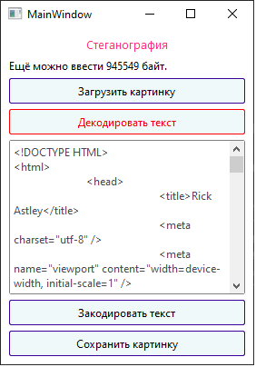
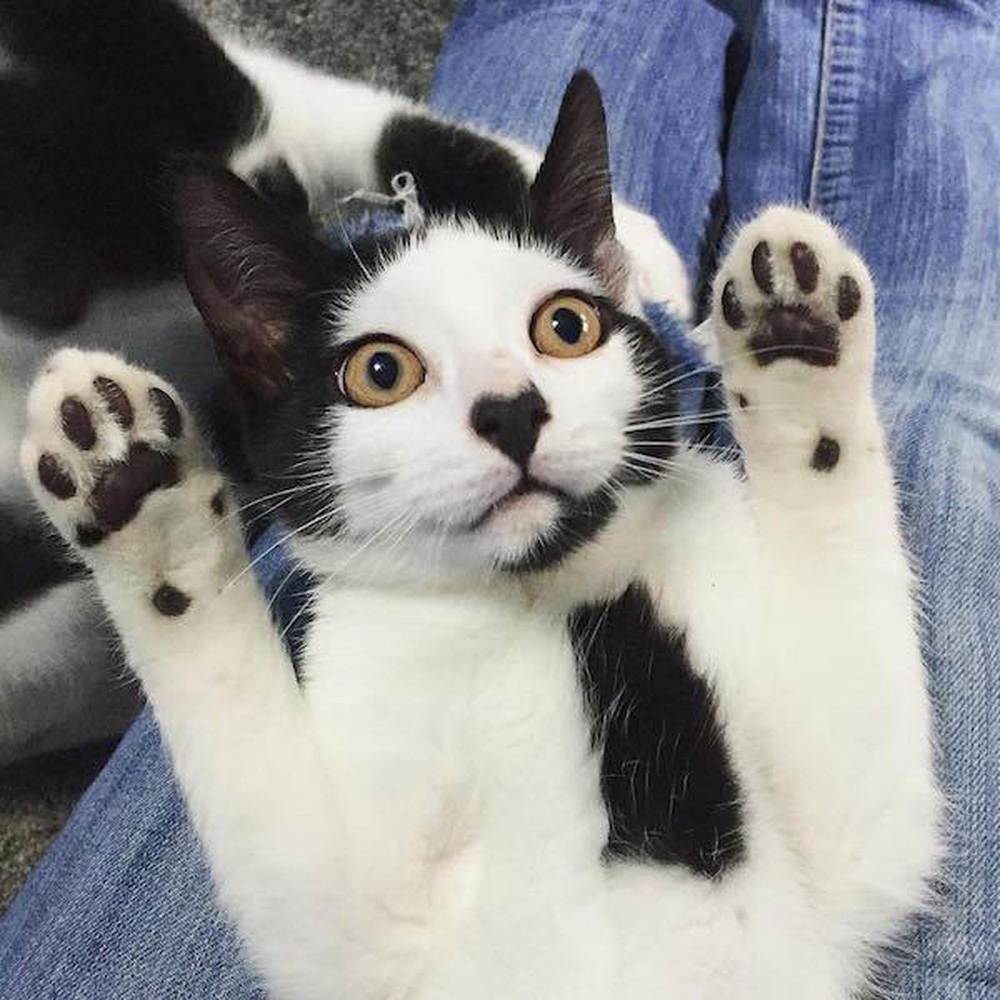

<p align="center">МИНИСТЕРСТВО НАУКИ  И ВЫСШЕГО ОБРАЗОВАНИЯ РОССИЙСКОЙ ФЕДЕРАЦИИ<br>
Федеральное государственное автономное образовательное учреждение высшего образования<br>
"КРЫМСКИЙ ФЕДЕРАЛЬНЫЙ УНИВЕРСИТЕТ им. В. И. ВЕРНАДСКОГО"<br>
ФИЗИКО-ТЕХНИЧЕСКИЙ ИНСТИТУТ<br>
Кафедра компьютерной инженерии и моделирования</p>
<br>
<h3 align="center">Отчёт по лабораторной работе № 5<br> по дисциплине "Программирование"</h3>
<br><br>
<p>студента 1 курса группы ИВТ-б-о-201(1)<br>
Задорожного Глеба Алексеевича<br>
направления подготовки 09.03.01 "Информатика и вычислительная техника"</p>
<br><br>
<table>
<tr><td>Научный руководитель<br> старший преподаватель кафедры<br> компьютерной инженерии и моделирования</td>
<td>(оценка)</td>
<td>Чабанов В.В.</td>
</tr>
</table>
<br><br>
<p align="center">Симферополь, 2021</p>
<hr>

## <p align="center">Лабораторная работа №5 Стеганография
## Цель:

1. Изучить базовые встроенные элементы фреймворка Qt предназначенные для создания приложений с графическим интерфейсом пользователя (GUI);
2. Изучить сигнально-слотовую систему, как один из способов организации взаимодействия компонентов GUI;
3. Получить практический навык работы с побитовыми операторами.

## Постановка задачи
Создать десктоп приложение с GUI позволяющее сохранять текстовую информацию в изображение формата png без видимого изменения исходного изображения. Приложение должно позволять сохранять текст в картинку и извлекать текст из картинки.

## Ход работы

В результате выполнения лабораторной работы я подготовил графический интерфейс. Интерфейс был создан в Qt Designer, смотреть рисунок 1.

<div align="center"></div><p align="center">Рисунок 1. Графический интерфейс приложения.</p>

Затем написал функционал к графическому интерфейсу, на С++ используя QT Creator, а для Python версии использовал PySide6.

После декодирования картинки предложенной в условии задания я получил код html страницы. 


| Вопрос  | Ответ |
| ------------- | ------------- |
| Как зовут и что он обещал?  | Зовут Rick Astley, обещал поделиться новым трейлером Grand Theft Auto VI. |

На рисунке 2 представлена картинка с зашифрованным текстом.
<div align="center"></div><p align="center">Рисунок 2. Картинка с зашифрованным текстом.</p>

Ниже код C++ mainwindow.cpp

```c++

#include "mainwindow.h"
#include "ui_mainwindow.h"
#include <QFileDialog>
#include <QBitArray>
MainWindow::MainWindow(QWidget *parent)
    : QMainWindow(parent)
    , ui(new Ui::MainWindow)
{
    ui->setupUi(this);
    connect(ui->upload_img_btn,&QPushButton::clicked,this,&MainWindow::loadImage);
}

MainWindow::~MainWindow()
{
    delete ui;
}

void MainWindow::msgChanged()
{


qint32 how_much_size = image.width()*image.height()*3 - ui->text_inp->toPlainText().toUtf8().size()*8 - 24 - 32; //24 - mark ,32 - size (fix)
how_much_size = how_much_size/8;
if(how_much_size <0){
    ui->status_lbl->setText(QString("Превышает на %1 байт.").arg(how_much_size*-1));
}else{
    ui->status_lbl->setText(QString("Ещё можно ввести %1 байт.").arg(how_much_size));

}
}

void MainWindow::loadImage()
{
QString fileName = QFileDialog::getOpenFileName(this, "Open Image", "", "Допустимые форматы (*.png)");
if  (fileName !=  ""){
    image.load(fileName);
    image.convertTo(QImage::Format_ARGB32);
    ui->status_lbl->setText("Изображение успешно загружено");

if(get_status_slts()){
    connect(ui->save_img_btn,&QPushButton::clicked,this,&MainWindow::saveImage);
    connect(ui->encode_text_btn,&QPushButton::clicked,this,&MainWindow::encodeMsg);
    connect(ui->decode_text_btn,&QPushButton::clicked,this,&MainWindow::decodeMsg);
    connect(ui->text_inp,&QPlainTextEdit::textChanged,this,&MainWindow::msgChanged);
    set_status_slts(false);}
}
}


void MainWindow::saveImage()
{
QString fileName = QFileDialog::getSaveFileName(this, "Save Image", "", "Допустимые форматы (*.png)");
    if  (fileName !=  ""){
    image.save(fileName);
    ui->status_lbl->setText("Изображение успешно сохранено");
    }else{
      ui->status_lbl->setText("Изображение не сохранено");
    }
}


QBitArray get_bits_array(QByteArray arr){
    qint32 count = arr.size();
    QBitArray bits(count*8);
    for(qint32 i = 0; i < count; ++i) {
      for(qint32 b = 0; b < 8; b++) {
        bits.setBit( i * 8 + b, arr.at(i) & (1 << (7 - b)) );
    }}
return bits;
}


void MainWindow::encodeMsg(){
    QByteArray msgText = ui->text_inp->toPlainText().toUtf8();
    if (image.width()*image.height()*3 >= (msgText.size()+3+4)*8){
            QBitArray bits_text = get_bits_array(msgText);
            QByteArray target;
            QDataStream s(&target, QIODevice::ReadWrite);
            qint32 value = msgText.size();
            s << value;
            QBitArray bits_size = get_bits_array(target);
            QBitArray bits_mark = get_bits_array(QString("❤").toUtf8());
            qint32 full_msg_size = bits_text.size()+bits_size.size()+bits_mark.size();
            QBitArray full_msg(full_msg_size);
           int ir=0;
            for(qint32 i=0;i<bits_mark.size();i++){
                full_msg.setBit(ir, bits_mark[i]);
                ir++;
            }
            for(qint32 i=0;i<bits_size.size();i++){

                full_msg.setBit(ir, bits_size[i]);
                ir++;
            }
            for(qint32 i=0;i<bits_text.size();i++){
                full_msg.setBit(ir, bits_text[i]);
                ir++;
            }
            qint32 count_bit = 0;
            for(qint32 i=0;i<image.height();i++){
                for(qint32 j=0;j<image.width();j++){
                    QColor color = image.pixelColor(j,i);
                    if (full_msg[count_bit]){//1
                        color.setRed(((color.red()>>1)<<1)+1);
                    }else{//0
                        color.setRed(((color.red()>>1)<<1));
                    }
                    count_bit++;
                    if (count_bit>=full_msg_size){
                        image.setPixelColor(j,i,color);break;}

                    if (full_msg[count_bit]){//1
                        color.setGreen(((color.green()>>1)<<1)+1);
                    }else{//0
                        color.setGreen(((color.green()>>1)<<1));
                    }
                    count_bit++;
                    if (count_bit>=full_msg_size){
                        image.setPixelColor(j,i,color);
                        break;}
                    if (full_msg[count_bit]){//1
                        color.setBlue(((color.blue()>>1)<<1)+1);
                    }else{//0
                        color.setBlue(((color.blue()>>1)<<1));
                    }
                    count_bit++;
                    image.setPixelColor(j,i,color);
                    if (count_bit>=full_msg_size)
                        break;
                }
                if (count_bit>=full_msg_size)
                    break;
            }
        ui->status_lbl->setText("Сообщение добавлено в картинку!");
    }else{
        ui->status_lbl->setText("Ошибка. Не достаточно места!");
    }
}


void MainWindow::decodeMsg(){
    QBitArray bits_mark = get_bits_array(QString("❤").toUtf8());
    qint32 count_mark = 0;
    QBitArray bits_mark_new(24);
    for(qint32 i=0;i<image.height();i++){
        if(count_mark>23)
            break;
        for(qint32 j=0;j<image.width();j++){
            QColor color = image.pixelColor(j,i);
            if (color.red()%2 == 0){
                bits_mark_new.setBit(count_mark,0);

            }else{
                bits_mark_new.setBit(count_mark,1);
            }
            count_mark++;
            if (color.green()%2 == 0){
                bits_mark_new.setBit(count_mark,0);

            }else{
                bits_mark_new.setBit(count_mark,1);
            }
            count_mark++;
            if (color.blue()%2 == 0){
                bits_mark_new.setBit(count_mark,0);
            }else{
                bits_mark_new.setBit(count_mark,1);
            }
             count_mark++;
            if(count_mark>23)
                break;
        }
    }
     if(bits_mark_new != bits_mark){
         ui->status_lbl->setText("Сообщение не обнаружено");
         return;
     }
     qint32 count_size = 0;
     QBitArray bits_size_new(32);
    qint32 slp = -1;
     for(qint32 i=0;i<image.height();i++){
         for(qint32 j=0;j<image.width();j++){
            slp++;
             if(slp < 8){
                 continue;}
             QColor color = image.pixelColor(j,i);
             if (color.red()%2 == 0){
                 bits_size_new.setBit(count_size,0);
             }else{
                 bits_size_new.setBit(count_size,1);
             }
             count_size++;
             if(count_size>31)
                 break;
             if (color.green()%2 == 0){
                 bits_size_new.setBit(count_size,0);
             }else{
                 bits_size_new.setBit(count_size,1);
             }
             count_size++;
             if(count_size>31)
                 break;
             if (color.blue()%2 == 0){
                 bits_size_new.setBit(count_size,0);
             }else{
                 bits_size_new.setBit(count_size,1);
             }
             count_size++;
             if(count_size>31)
                 break;
         }
         if(count_size>31)
             break;
     }
    ui->status_lbl->setText(QString("Присутствует сообщение длиной %1 байт").arg(bits_size_new.toUInt32(QSysInfo::BigEndian)));

    qint32 count_textbit = 0;
    QBitArray bits_text_new(bits_size_new.toUInt32(QSysInfo::BigEndian)*8);
   slp = 0;
    qint32 sz_text = bits_size_new.toUInt32(QSysInfo::BigEndian)*8;
    for(qint32 i=0;i<image.height();i++){
        for(qint32 j=0;j<image.width();j++){
            QColor color = image.pixelColor(j,i);
            if (slp <56){slp++;}else{
            if (color.red()%2 == 0){
                bits_text_new.setBit(count_textbit,0);
            }else{
                bits_text_new.setBit(count_textbit,1);
            }
            count_textbit++;}
            if (slp <56){slp++;}else{
            if(count_textbit>sz_text-1)
                break;
            if (color.green()%2 == 0){
                bits_text_new.setBit(count_textbit,0);
            }else{
                bits_text_new.setBit(count_textbit,1);
            }
            count_textbit++;}

            if (slp <56){slp++;}else{
            if(count_textbit>sz_text-1)
                break;
            if (color.blue()%2 == 0){
                bits_text_new.setBit(count_textbit,0);
            }else{
                bits_text_new.setBit(count_textbit,1);
            }
            count_textbit++;}

            if(count_textbit>sz_text-1)
                break;
        }
        if(count_textbit>sz_text-1)
            break;
    }
    QByteArray text_fin;
     unsigned char tmp = 0;
     qint32 counter = 0;
   for(qint32 i=0;i< bits_text_new.size()/8;i++){
       for(qint32 j=0;j<8;j++){
           tmp = (tmp<<1) |  (bits_text_new[counter] &1);
            counter++;
       }
       text_fin.push_back(tmp);
       tmp=0;
    }
    ui->text_inp->setPlainText(QString::fromUtf8(text_fin));
}


```


Ниже код Python 
```python
# -*- coding: utf-8 -*-

################################################################################
## Form generated from reading UI file 'mainwindowyjTjPb.ui'
##
## Created by: Qt User Interface Compiler version 6.0.3
##
## WARNING! All changes made in this file will be lost when recompiling UI file!
################################################################################

from PySide6.QtCore import *
from PySide6.QtGui import *
from PySide6.QtWidgets import *


class Ui_MainWindow(object):
    def setupUi(self, MainWindow):
        if not MainWindow.objectName():
            MainWindow.setObjectName(u"MainWindow")
        MainWindow.resize(278, 370)
        MainWindow.setStyleSheet(u"QMainWindow{background-color:white;}\n"
"QPushButton{border: 1px solid #360099;border-radius:2px;padding-top:5px;padding-bottom:5px;background-color:#F0F9FA;}\n"
"QPushButton:hover{color: red;border-color: 1px solid red;}\n"
"QPushButton:pressed{color: #AB274F;border-color: 2px solid #AB274F;}\n"
"\n"
"\n"
"QPlainTextEdit{\n"
"border: 1px solid gray;\n"
"border-radius:2px;}\n"
"\n"
"QPlainTextEdit:focus{\n"
"border: 1px solid #046167;\n"
"}")
        self.centralwidget = QWidget(MainWindow)
        self.centralwidget.setObjectName(u"centralwidget")
        self.centralwidget.setMinimumSize(QSize(278, 370))
        self.centralwidget.setMaximumSize(QSize(278, 670))
        self.verticalLayout = QVBoxLayout(self.centralwidget)
        self.verticalLayout.setObjectName(u"verticalLayout")
        self.verticalLayout_2 = QVBoxLayout()
        self.verticalLayout_2.setObjectName(u"verticalLayout_2")
        self.main_lbl = QLabel(self.centralwidget)
        self.main_lbl.setObjectName(u"main_lbl")

        self.verticalLayout_2.addWidget(self.main_lbl)

        self.status_lbl = QLabel(self.centralwidget)
        self.status_lbl.setObjectName(u"status_lbl")

        self.verticalLayout_2.addWidget(self.status_lbl)

        self.upload_img_btn = QPushButton(self.centralwidget)
        self.upload_img_btn.setObjectName(u"upload_img_btn")

        self.verticalLayout_2.addWidget(self.upload_img_btn)

        self.decode_text_btn = QPushButton(self.centralwidget)
        self.decode_text_btn.setObjectName(u"decode_text_btn")

        self.verticalLayout_2.addWidget(self.decode_text_btn)

        self.text_inp = QPlainTextEdit(self.centralwidget)
        self.text_inp.setObjectName(u"text_inp")
        self.text_inp.setStyleSheet(u"color:#474A51;")

        self.verticalLayout_2.addWidget(self.text_inp)

        self.encode_text_btn = QPushButton(self.centralwidget)
        self.encode_text_btn.setObjectName(u"encode_text_btn")

        self.verticalLayout_2.addWidget(self.encode_text_btn)

        self.save_img_btn = QPushButton(self.centralwidget)
        self.save_img_btn.setObjectName(u"save_img_btn")

        self.verticalLayout_2.addWidget(self.save_img_btn)


        self.verticalLayout.addLayout(self.verticalLayout_2)

        MainWindow.setCentralWidget(self.centralwidget)

        self.retranslateUi(MainWindow)

        QMetaObject.connectSlotsByName(MainWindow)
    # setupUi

    def retranslateUi(self, MainWindow):
        MainWindow.setWindowTitle(QCoreApplication.translate("MainWindow", u"MainWindow", None))
        self.main_lbl.setText(QCoreApplication.translate("MainWindow", u"<center style=\"color:#FF3379;font-size:10pt;\">\u0421\u0442\u0435\u0433\u0430\u043d\u043e\u0433\u0440\u0430\u0444\u0438\u044f</center>", None))
        self.status_lbl.setText("")
        self.upload_img_btn.setText(QCoreApplication.translate("MainWindow", u"\u0417\u0430\u0433\u0440\u0443\u0437\u0438\u0442\u044c \u043a\u0430\u0440\u0442\u0438\u043d\u043a\u0443", None))
        self.decode_text_btn.setText(QCoreApplication.translate("MainWindow", u"\u0414\u0435\u043a\u043e\u0434\u0438\u0440\u043e\u0432\u0430\u0442\u044c \u0442\u0435\u043a\u0441\u0442", None))
        self.text_inp.setPlaceholderText(QCoreApplication.translate("MainWindow", u"\u0412\u0432\u0435\u0434\u0438\u0442\u0435 \u0442\u0435\u043a\u0441\u0442", None))
        self.encode_text_btn.setText(QCoreApplication.translate("MainWindow", u"\u0417\u0430\u043a\u043e\u0434\u0438\u0440\u043e\u0432\u0430\u0442\u044c \u0442\u0435\u043a\u0441\u0442", None))
        self.save_img_btn.setText(QCoreApplication.translate("MainWindow", u"\u0421\u043e\u0445\u0440\u0430\u043d\u0438\u0442\u044c \u043a\u0430\u0440\u0442\u0438\u043d\u043a\u0443", None))
    # retranslateUi


class MainWindow(QMainWindow):
    def __init__(self):
        super(MainWindow, self).__init__()
        self.ui = Ui_MainWindow()
        self.ui.setupUi(self)
        self.ui.upload_img_btn.clicked.connect(self.loadImage)

        self.status_slts = True
    


    @Slot()
    def loadImage(self):
        fileName, _ = QFileDialog.getOpenFileName(self, "Open Image", "", "Допустимые форматы (*.png)")
        if len(fileName) != 0:
            self.image = QImage()
            self.image.load(fileName)
            self.image.convertTo(QImage.Format_ARGB32)
            self.ui.status_lbl.setText("Изображение успешно загружено")
            if self.status_slts:
              self.ui.save_img_btn.clicked.connect(self.saveImage)
              self.ui.encode_text_btn.clicked.connect(self.encodeMsg)
              self.ui.decode_text_btn.clicked.connect(self.decodeMsg)
              self.ui.text_inp.textChanged.connect(self.msgChanged)
              self.status_slts = False
        else:
            self.ui.status_lbl.setText("Изображение не загружено")
    @Slot()
    def msgChanged(self):
      how_much_size = self.image.width()*self.image.height()*3 - len(self.ui.text_inp.toPlainText().encode())*8 - 24 - 32
      how_much_size = int(how_much_size/8)
      if how_much_size<0:
        self.ui.status_lbl.setText(f"Превышает на {how_much_size*-1} байт.")
      else:
        self.ui.status_lbl.setText(f"Ещё можно ввести: {how_much_size} байт")

    @Slot()
    def saveImage(self):
      fileName, _ = QFileDialog.getSaveFileName(self, "Save Image", "", "Допустимые форматы (*.png)")
      if len(fileName) != 0:
          self.image.save(fileName)
          self.ui.status_lbl.setText("Изображение успешно сохранено")
      else:
          self.ui.status_lbl.setText("Изображение не сохранено")
    @Slot()
    def encodeMsg(self):
      msgText = self.ui.text_inp.toPlainText().encode()

      if self.image.width()*self.image.height()*3 >= (len(msgText)+3+4)*8:
        def get_bits(bytes_arr):
          bits_arr = []
          for b in bytes_arr:
              tmp_bits_arr=[]
              for i in range(8):
                  tmp_bits_arr.append((b >> i) & 1)
              tmp_bits_arr.reverse()
              for u in tmp_bits_arr:
                bits_arr.append(u)
          return bits_arr


        full_bits = [*get_bits(str("❤").encode()),*get_bits((len(msgText)).to_bytes(4, byteorder="big")),*get_bits(msgText)]
        counter_bit = 0
        for x in range(self.image.height()):
          for y in range(self.image.width()):
            color = self.image.pixelColor(y, x)
            if full_bits[counter_bit]:
              color.setRed(((color.red()>>1)<<1)+1)
              # print(((color.red()>>1)<<1)+1)
            else:
              color.setRed(((color.red()>>1)<<1))
              # print(((color.red()>>1)<<1))
            counter_bit+=1
            if counter_bit>=len(full_bits):
              self.image.setPixelColor(y,x,color)
              break


            if full_bits[counter_bit]:
              color.setGreen(((color.green()>>1)<<1)+1)
              # print(((color.green()>>1)<<1)+1)
            else:
              color.setGreen(((color.green()>>1)<<1))
              # print(((color.green()>>1)<<1))
            counter_bit+=1
            if counter_bit>=len(full_bits):
              self.image.setPixelColor(y,x,color)
              break

            if full_bits[counter_bit]:
              color.setBlue(((color.blue()>>1)<<1)+1)
              # print(((color.blue()>>1)<<1)+1)
            else:
              color.setBlue(((color.blue()>>1)<<1))
              # print(((color.blue()>>1)<<1))
            counter_bit+=1
            self.image.setPixelColor(y,x,color)
            if counter_bit>=len(full_bits):
              break
          if counter_bit>=len(full_bits):
            break


        counter_key = 0
        keyBits_new  = []
        slp = -1
        for x in range(self.image.height()):
          for y in range(self.image.width()):
            slp+=1
            # if slp <8:
            #   continue
            color = self.image.pixelColor(y,x)

            if color.red()%2 == 0:
              keyBits_new.append(0)
            else:
              keyBits_new.append(1)    
            counter_key+=1
            if counter_key>31+100:
              break

            if color.green()%2 == 0:
              keyBits_new.append(0)
            else:
              keyBits_new.append(1)    
            counter_key+=1
            if counter_key>31+100:
              break

            if color.blue()%2 == 0:
              keyBits_new.append(0)
            else:
              keyBits_new.append(1)    
            counter_key+=1
            if counter_key>31:
              break
          if counter_key>31+100:
            break
        # print(keyBits_new, "key-size", full_bits)


        self.ui.status_lbl.setText("Сообщение добавлено в картинку!")
      else:
        self.ui.status_lbl.setText("Ошибка. Не достаточно места!")


    @Slot()
    def decodeMsg(self):
        def get_bits(bytes_arr):
          bits_arr = []
          for b in bytes_arr:
              tmp_bits_arr=[]
              for i in range(8):
                  tmp_bits_arr.append((b >> i) & 1)
              tmp_bits_arr.reverse()
              for u in tmp_bits_arr:
                bits_arr.append(u)
          return bits_arr

        markBits_default = get_bits(str("❤").encode())
        counter_mark = 0
        markBits_new  = []
        for x in range(self.image.height()):
          if counter_mark>23:
            break
          for y in range(self.image.width()):
            color = self.image.pixelColor(y, x)

            if color.red()%2 == 0:
              markBits_new.append(0)
            else:
              markBits_new.append(1)    
            counter_mark+=1

            if color.green()%2 == 0:
              markBits_new.append(0)
            else:
              markBits_new.append(1)    
            counter_mark+=1

            if color.blue()%2 == 0:
              markBits_new.append(0)
            else:
              markBits_new.append(1)    
            counter_mark+=1
            if counter_mark>23:
              break
        if markBits_new != markBits_default:
            self.ui.status_lbl.setText("Сообщение не обнаружено")
            return
        counter_key = 0
        keyBits_new  = []
        slp = -1
        for x in range(self.image.height()):
          for y in range(self.image.width()):
            slp+=1
            if slp <8:
              continue
            color = self.image.pixelColor(y,x)

            if color.red()%2 == 0:
              keyBits_new.append(0)
            else:
              keyBits_new.append(1)    
            counter_key+=1
            if counter_key>31:
              break

            if color.green()%2 == 0:
              keyBits_new.append(0)
            else:
              keyBits_new.append(1)    
            counter_key+=1
            if counter_key>31:
              break

            if color.blue()%2 == 0:
              keyBits_new.append(0)
            else:
              keyBits_new.append(1)    
            counter_key+=1
            if counter_key>31:
              break
          if counter_key>31:
            break
        # print(keyBits_new, "key-size")

        counter_fbkey = 0
        size_bytes = bytearray()

        for i in range(int(len(keyBits_new)/8)):
          tmp = 0
          for j in range(8):
            tmp = (tmp<<1) | (keyBits_new[counter_fbkey] &1)
            # print((keyBits_new[counter_fbkey] &1))
            counter_fbkey +=1
          size_bytes.append(tmp)


        size =int.from_bytes(size_bytes, 'big')
        # print(size.decode())

        self.ui.status_lbl.setText(f"Присутствует сообщение длиной {size} байт")


        counter_text = 0
        textBits_new  = []
        slp = 0
        size = 8*size
        for x in range(self.image.height()):
          for y in range(self.image.width()):
            color = self.image.pixelColor(y,x)

            if slp <56:
              slp+=1
            else:
              if color.red()%2 == 0:
                textBits_new.append(0)
              else:
                textBits_new.append(1)  
              counter_text+=1

            if slp <56:
              slp+=1
            else:
              if counter_text>size-1:
                break
              if color.green()%2 == 0:
                textBits_new.append(0)
              else:
                textBits_new.append(1)  
              counter_text+=1

            if slp <56:
              slp+=1
            else:
              if counter_text>size-1:
                break
              if color.blue()%2 == 0:
                textBits_new.append(0)
              else:
                textBits_new.append(1)  
              counter_text+=1

            if counter_text>size-1:
              break
          if counter_text>size-1:
            break


        counter_fbtext =0
        text_bytes = bytearray()
        for i in range(int(len(textBits_new)/8)):
          tmp = 0
          for j in range(8):
            tmp = (tmp<<1) | (textBits_new[counter_fbtext] &1)
            counter_fbtext +=1
          text_bytes.append(tmp)
          # print(text_bytes)
        self.ui.text_inp.setPlainText(text_bytes.decode())


if __name__ == "__main__":
    import sys
    app = QApplication(sys.argv)
  
    window = MainWindow()
    window.show()
  
    sys.exit(app.exec())


```


## Вывод: 

Я изучил базовые встроенные элементы фреймворка Qt предназначенные для создания приложений с графическим интерфейсом пользователя (GUI); Изучил сигнально-слотовую систему, как один из способов организации взаимодействия компонентов GUI;
Получил практический навык работы с побитовыми операторами. 

